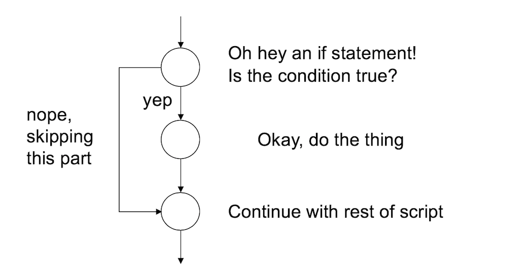

```{r,echo=FALSE}
rm(list=objects()) # start with a clean workspace
source("knitr_tweaks.R")
```


A second kind of flow control that programming languages provide is the ability to evaluate **conditional statements**. Unlike loops, which can repeat over and over again, a conditional statement only executes once, but it can switch between different possible commands depending on a condition that is specified by the programmer. The power of these commands is that they allow the program itself to make choices, and in particular, to make different choices depending on the context in which the program is run. The most prominent of example of a conditional statement is the `if` statement, and the accompanying `else` statement.^[There are other ways of making conditional statements in R. In particular, the `ifelse` function and the `switch` functions can be very useful in different contexts.] 

## If

The basic format of an `if` statement in R is as follows:
```
if ( CONDITION ) {
  STATEMENT1
  STATEMENT2
  ETC 
}
```

And the execution of the statement is pretty straightforward. If the condition is `TRUE`, then R will execute the statements contained in the curly braces. If the condition is `FALSE`, then it does not. So the way R processes an `if` statement is illustrated by this schematic:




## If-else

If you want to, you can extend the `if` statement to include an `else` statement as well, leading to the following syntax:


```
if ( CONDITION ) {
  STATEMENT1
  STATEMENT2
  ETC
} else {
  STATEMENT3
  STATEMENT4
  ETC
}
```
As you’d expect, the interpretation of this version is similar. If the condition is `TRUE`, then the contents of the first block of code (i.e., *statement1*, *statement2*, etc) are executed; but if it is `FALSE`, then the contents of the second block of code (i.e., *statement3*, *statement4*, etc) are executed instead. So the schematic illustration of an if-else construction looks like this:


In other words, when we use an if-else pair, we can define different behaviour for our script for both cases. 

## An example

To give you a feel for how you can use `if` and `else`, the example that I’ll show you is a script ([feelings.R](./scripts/feelings.R)) that prints out a different message depending the day of the week. Here’s the script:

```{r,eval=FALSE}
if(today == "Monday") {
  print("I don’t like Mondays")
} else {
  print("I’m a happy little automaton")
}
```

So let's set the value of `today` to `Monday` and source the script:

```{r eval = FALSE}
today <- "Monday"
source("./scripts/feelings.R")
```
```{r branch_monday_feels,echo=FALSE}
# force the script to evaluate in the local environment 
# the knitr niceties
today <- "Monday"
source("./scripts/feelings.R", local = TRUE)
```

That's very sad. However, tomorrow should be better:

```{r,eval=FALSE}
today <- "Tuesday"
source("./scripts/feelings.R")
```
```{r,echo=FALSE}
today <- "Tuesday"
source("./scripts/feelings.R", local = TRUE)
```

## Another example

One useful feature of `if` and `else` is that you can chain several of them together to switch between several different possibilities. For example, the [more_feelings.R](./scripts/more_feelings.R) script contains this code:

```{r,eval=FALSE}
if(today == "Monday") {
  print("I don’t like Mondays")
  
} else if(today == "Tuesday") {
  print("I’m a happy little automaton")
  
} else if(today == "Wednesday") {
  print("Wednesday is beige")
  
} else {
  print("eh, I have no feelings")
}
```

This code allows our little `r emo::ji("robot")` to have opinions about several different days. Imagine that we have a vector `days` that lists the name of every day of the week: 

```{r}
days <- c(
  "Monday", "Tuesday","Wednesday",
  "Thursday","Friday","Saturday",
  "Sunday"
)
```

Now let's combine what we learned in the [loops](./loops.html) section with our new skills with `if` and `else`. Let's loop over all the `days` and ask R to express some feelings on every day:

```{r,eval=FALSE}
for(today in days) {
  source("./scripts/more_feelings.R") 
}
```
```{r,echo=FALSE}
for(today in days) {
  source("./scripts/more_feelings.R", local = TRUE) 
}
```

## Exercises

- Write your own version of the "feelings" script that expresses your opinions about summer, winter, autumn and spring. Test your script out.
- Expand your script so that it loops over vector of four `seasons` and prints out your feelings about each of them

The solutions for these exercises are [here](./scripts/solutions_branch.R).


