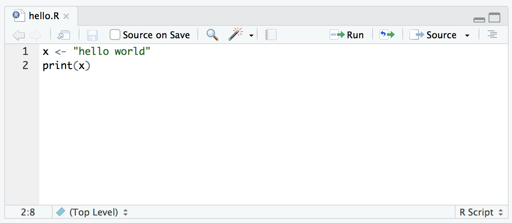
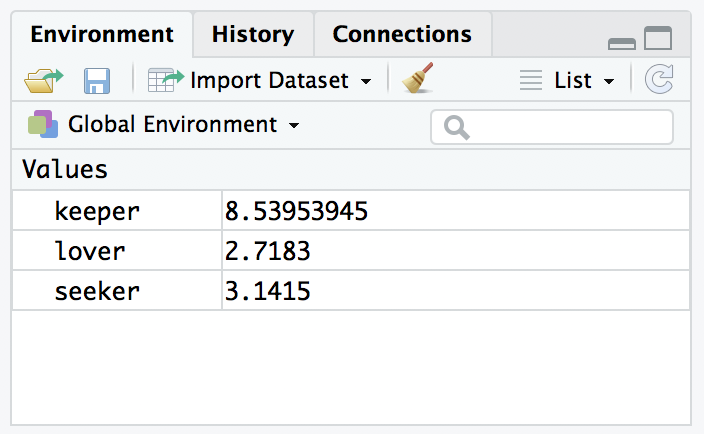
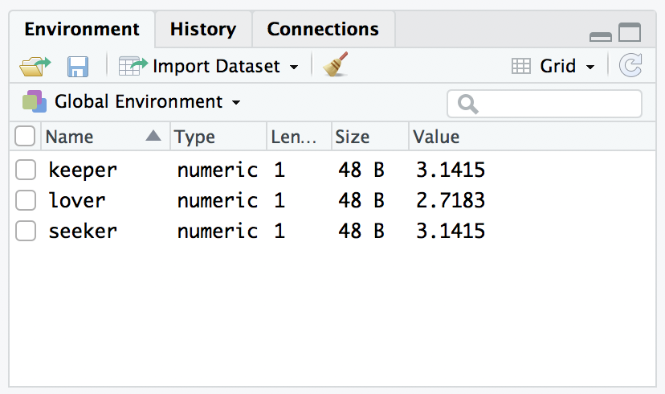
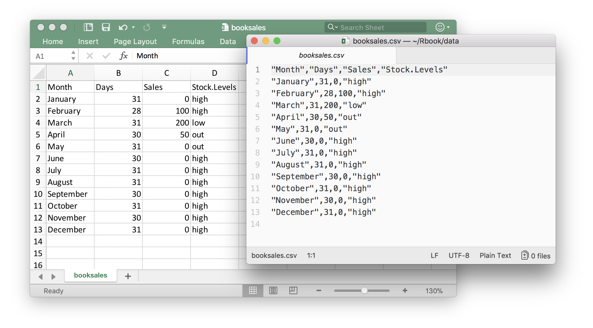
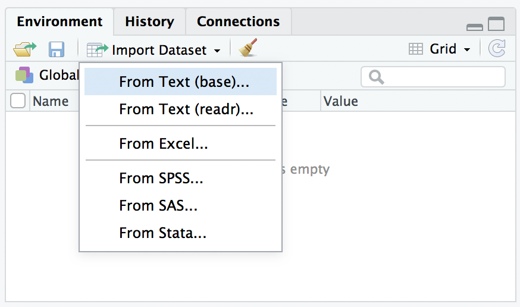
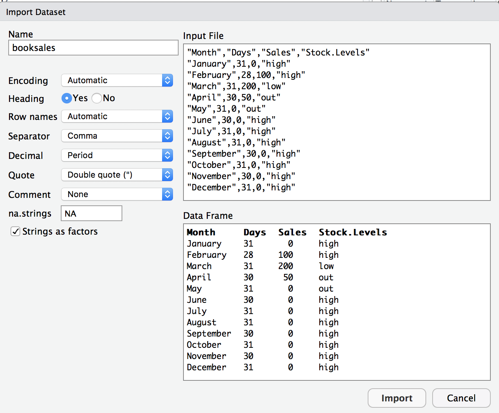

```{r,echo=FALSE}
rm(list=objects()) # start with a clean workspace
source("knitr_tweaks.R")
```


> Machine dreams hold a special vertigo. <br>
> &nbsp;&nbsp;&nbsp;&nbsp;&nbsp;&nbsp;--William Gibson, *Count Zero*, 1986


In the last chapter our main goal was to get started in R. As we go through the book we’ll run into a lot of new R concepts, which I’ll explain alongside the relevant data analysis concepts. However, there’s still quite a few things that I need to talk about now, otherwise we’ll run into problems when we start trying to work with data and do statistics. So that’s the goal in this chapter: to build on the introductory content from the last chapter, to get you to the point that we can start using R for statistics. Broadly speaking, the chapter comes in two parts. The first half of the chapter is devoted to the “mechanics” of R: installing and loading packages, managing the workspace, navigating the file system, and loading and saving data. In the second half, I’ll talk more about what kinds of variables exist in R, and introduce three new kinds of variables: factors, data frames and formulas. I’ll finish up by talking a little bit about the help documentation in R as well as some other avenues for finding assistance. In general, I’m not trying to be comprehensive in this chapter, I’m trying to make sure that you’ve got the basic foundations needed to tackle the content that comes later in the book. However, a lot of the topics are revisited in more detail later.

## Comments

Before discussing any of the more complicated stuff, I want to introduce the comment character, `#`. It has a simple meaning: it tells R to ignore everything else you’ve written on this line. You won’t have much need of the `#` character immediately, but it’s *very useful* later on when writing scripts. However, while you don’t need to use it, I want to be able to include comments in my R extracts. For instance, if you read this

```{r}
seeker <- 3.1415          # create the first variable
lover <- 2.7183           # create the second variable
keeper <- seeker * lover  # now multiply them to create a third one
print(keeper)             # print out the value of ’keeper’
```

it’s a lot easier to understand what I’m doing than if I had omitted the comments.^[Also notice that I used `print(keeper)` rather than just typing keeper. Later on in the text I’ll sometimes use the `print` function to display things because I think it helps make clear what I’m doing, but in practice people rarely do this.] So, from now on, you’ll start seeing some `#` characters appearing in the extracts, with some human-readable explanatory remarks next to them. These are still perfectly legitimate commands, since R knows that it should ignore the `#` character and everything after it. But hopefully they’ll help make things a little easier to understand.

## Scripts

Computer programs come in quite a few different forms: the kind of program that we’re mostly interested in from the perspective of everyday data analysis using R is known as a **script**. The idea behind a script is that, instead of typing your commands into the R console one at a time, instead you write them all in a text file. Then, once you’ve finished writing them and saved the text file, you can get R to execute all the commands in your file by using the `source` function. In a moment I’ll show you exactly how this is done, but first I’d better explain why you should care.


### Why use scripts?

Before discussing scripting and programming concepts in any more detail, it’s worth stopping to ask why you should bother. After all, if you look at the R commands that I’ve used everywhere else this book, you’ll notice that they’re all formatted as if I were typing them at the command line. Outside this chapter you won’t actually see any scripts. Do not be fooled by this. The reason that I’ve done it that way is purely for pedagogical reasons. My goal in this book is to teach statistics and to teach R. To that end, what I’ve needed to do is chop everything up into tiny little slices: each section tends to focus on one kind of statistical concept, and only a smallish number of R functions. As much as possible, I want you to see what each function does in isolation, one command at a time. By forcing myself to write everything as if it were being typed at the command line, it imposes a kind of discipline on me: it *prevents* me from piecing together lots of commands into one big script. From a teaching (and learning) perspective I think that’s the right thing to do... but from a *data analysis* perspective, it is not. When you start analysing real world data sets, you will rapidly find yourself needing to write scripts.

To understand why scripts are so very useful, it may be helpful to consider the drawbacks to typing commands directly at the command prompt. The approach that we’ve been adopting so far, in which you type commands one at a time, and R sits there patiently in between commands, is referred to as the **interactive style**. Doing your data analysis this way is rather like having a conversation ... a very annoying conversation between you and your data set, in which you and the data aren’t directly speaking to each other, and so you have to rely on R to pass messages back and forth. This approach makes a lot of sense when you’re just trying out a few ideas: maybe you’re trying to figure out what analyses are sensible for your data, or maybe just you’re trying to remember how the various R functions work, so you’re just typing in a few commands until you get the one you want. In other words, the interactive style is very useful as a tool for exploring your data. However, it has a number of drawbacks:

- *It’s hard to save your work effectively.* You can save the workspace, so that later on you can load any variables you created. You can save your plots as images. And you can even save the history or copy the contents of the R console to a file. Taken together, all these things let you create a reasonably decent record of what you did. But it does leave a lot to be desired. It seems like you ought to be able to save a single file that R could use (in conjunction with your raw data files) and reproduce everything (or at least, everything interesting) that you did during your data analysis.
- *It’s annoying to have to go back to the beginning when you make a mistake.* Suppose you’ve just spent the last two hours typing in commands. Over the course of this time you’ve created lots of new variables and run lots of analyses. Then suddenly you realise that there was a nasty typo in the first command you typed, so all of your later numbers are wrong. Now you have to fix that first command, and then spend another hour or so combing through the R history to try and recreate what you did.
- *You can’t leave notes for yourself.* Sure, you can scribble down some notes on a piece of paper, or even save a Word document that summarises what you did. But what you really want to be able to do is write down an English translation of your R commands, preferably right “next to” the commands themselves. That way, you can look back at what you’ve done and actually remember what you were doing. In the simple exercises we’ve engaged in so far, it hasn’t been all that hard to remember what you were doing or why you were doing it, but only because everything we’ve done could be done using only a few commands, and you’ve never been asked to reproduce your analysis six months after you originally did it! When your data analysis starts involving hundreds of variables, and requires quite complicated commands to work, then you really, really need to leave yourself some notes to explain your analysis to, well, yourself.
- *It’s nearly impossible to reuse your analyses later, or adapt them to similar problems.* Suppose that, sometime in January, you are handed a difficult data analysis problem. After working on it for ages, you figure out some really clever tricks that can be used to solve it. Then, in September, you get handed a really similar problem. You can sort of remember what you did, but not very well. You’d like to have a clean record of what you did last time, how you did it, and why you did it the way you did. Something like that would really help you solve this new problem.
- *It’s hard to do anything except the basics.* There’s a nasty side effect of these problems. Typos are inevitable. Even the best data analyst in the world makes a lot of mistakes. So the chance that you’ll be able to string together dozens of correct R commands in a row are very small. So unless you have some way around this problem, you’ll never really be able to do anything other than simple analyses.
- *It’s difficult to share your work other people.* Because you don’t have this nice clean record of what R commands were involved in your analysis, it’s not easy to share your work with other people. Sure, you can send them all the data files you’ve saved, and your history and console logs, and even the little notes you wrote to yourself, but odds are pretty good that no-one else will really understand what’s going on (trust me on this: I’ve been handed lots of random bits of output from people who’ve been analysing their data, and it makes very little sense unless you’ve got the original person who did the work sitting right next to you explaining what you’re looking at)


Ideally, what you’d like to be able to do is something like this... Suppose you start out with a data set `myrawdata.csv`. What you want is a single document – let’s call it `mydataanalysis.R` – that stores all of the commands that you’ve used in order to do your data analysis. Kind of similar to the R history but much more focused. It would only include the commands that you want to keep for later. Then, later on, instead of typing in all those commands again, you’d just tell R to run all of the commands that are stored in `mydataanalysis.R`. Also, in order to help you make sense of all those commands, what you’d want is the ability to add some notes or comments within the file, so that anyone reading the document for themselves would be able to understand what each of the commands actually does. But these comments wouldn’t get in the way: when you try to get R to run `mydataanalysis.R` it would be smart enough would recognise that these comments are for the benefit of humans, and so it would ignore them. Later on you could tweak a few of the commands inside the file (maybe in a new file called `mynewdatanalaysis.R`) so that you can adapt an old analysis to be able to handle a new problem. And you could email your friends and colleagues a copy of this file so that they can reproduce your analysis themselves.

In other words, what you want is a *script*.


### Our first script

Okay then. Since scripts are so terribly awesome, let’s write one. A script is just an ordinary text file, so you can write one in any text editor at all, but RStudio has a nice built in one so we'll use that. Go to the "File" menu, select "New File" and then choose "R Script". A new file will open in the top left panel of RStudio, into which we can type some commands. Let's type the following:
```{r,eval=FALSE}
x <- "hello world"
print(x)
```
Then save the script using the menus (File > Save) as `hello.R`. So far, nothing will happen. You should be looking at something like this:



If so, you have now successfully written your first R program. Because I don’t want to take screenshots for every single script, I’m going to present the content of scripts using the same kind of extracts that I've been using for everything else. So how do we run the script? I saved `hello.R` to a `scripts` folder, so I would run the script using the following command:
```{r}
source("./scripts/hello.R")
```
You can achieve the same outcome by clicking on the "source" button in RStudio, shown in the top right of the screenshot above. If we now inspect the workspace using a command like `who` or `objects`, we discover that R has created the new variable `x` within the workspace, and not surprisingly `x` is a character string containing the text `"hello world"`. And just like that, you’ve written your first program R. It really is that simple.

### Differences between scripts and the command line

For the most part, commands that you insert into a script behave in exactly the same way as they would if you typed the same thing in at the command line. The one major exception to this is that if you want a variable to be printed on screen, you need to explicitly tell R to print it. You can’t just type the name of the variable. For example, our `hello.R` script produced visible output. The following script does not:
```{r,echo=FALSE}
x <- "hello world"
x
```
It does still create the variable `x` when you `source` the script, but it won’t print anything on screen 

### Commenting your script

When writing up your data analysis as a script, one thing that is generally a good idea is to include a lot of comments in the code. That way, if someone else tries to read it (or if you come back to it several days, weeks, months or years later) they can figure out what’s going on. As a beginner, I think it’s especially useful to comment thoroughly, partly because it gets you into the habit of commenting the code, and partly because the simple act of typing in an explanation of what the code does will help you keep it clear in your own mind what you’re trying to achieve.


## Packages

In this section I discuss R **packages**, since almost all of the functions you might want to use in R come in packages. A package is basically just a big collection of functions, data sets and other R objects that are all grouped together under a common name. Some packages are already installed when you put R on your computer, but the vast majority of them of R packages are out there on the internet, waiting for you to download, install and use them.

When I first started writing this book, Rstudio didn’t really exist as a viable option for using R, and as a consequence I wrote a very lengthy section that explained how to do package management using raw R commands. It’s not actually terribly hard to work with packages that way, but it’s clunky and unpleasant. Fortunately, we don’t have to do things that way anymore. In this section, I’ll describe how to work with packages using the Rstudio tools, because they’re so much simpler. Along the way, you’ll see that whenever you get Rstudio to do something (e.g., install a package), you’ll actually see the R commands that get created. I’ll explain them as we go, because I think that helps you understand what’s going on.


However, before we get started, there’s a critical distinction that you need to understand, which is the difference between having a package **installed** on your computer, and having a package **loaded** in R. There are many thousands of R packages freely available “out there” on the internet. When you install R on your computer, you don’t get all of them: only about 30 or so come bundled with the basic R installation. So right now there are about 30 packages “installed” on your computer, and many many more that are not installed. So that’s what installed means: it means “it’s on your computer somewhere”. The critical thing to remember is that just because something is on your computer doesn’t mean R can use it. In order for R to be able to use one of your 30 or so installed packages, that package must also be “loaded”. Generally, when you open up R, only a few of these packages (about 7 or 8) are actually loaded. Basically what it boils down to is this:

- A package must be installed before it can be loaded. 
- A package must be loaded before it can be used.

This two step process might seem a little odd at first, but it does make a lot of sense when you think about the sheer scale of a programming langauge like R and you get the hang of it pretty quickly.

### The package panel in Rstudio

Right, let's get started. The first thing you need to do is look in the lower right hand panel in Rstudio. You’ll see a tab labelled “Packages”. Click on the tab, and you’ll see a list of packages that looks something like this:


Yours will list different packages than mine, of course, because I've installed quite a few additional packages as I've gone along. Every row in this panel corresponds to a different package, and every column is a useful piece of information about that package.^[If you’re using the command line, you can get the same information by typing `library()`.] Going from left to right, here’s what each column is telling you:

- The check box on the far left column indicates whether or not the package is loaded.
- The one word of text immediately to the right of the check box is the name of the package.
- The short passage of text next to the name is a brief description of the package.
- The number next to the description tells you what version of the package you have installed.
- The little x-mark next to the version number is a button that you can push to uninstall the package from your computer (you almost never need this).

### Loading a package

That seems straightforward enough, so let’s try loading and unloading packages. For this example, I’ll use the `foreign` package. The `foreign` package is a collection of tools that are handy when R needs to interact with files that are produced by other software packages (e.g., SPSS). It comes bundled with R, so it’s one of the ones that you have installed already, but it won’t be one of the ones loaded. Inside the `foreign` package is a function called `read.spss`. It’s a handy little function that you can use to import an SPSS data file into R, so let’s pretend we want to use it. Currently, the foreign package isn’t loaded, so if I ask R to tell me if it knows about a function called `read.spss` it tells me that there’s no such thing...
 
```{r,echo=FALSE}
if( exists( "read.spss" )) { 
  detach("package:foreign", unload=TRUE) # just quietly, make sure it's actually gone
}
```

```{r}
exists("read.spss")
```

Now let’s load the package. In Rstudio, the process is dead simple: go to the package tab, find the entry for the `foreign` package, and check the box on the left hand side. The moment that you do this, you’ll see a command like this appear in the R console...

```{r}
library("foreign")
```

The version you'll see in the console also specifies the `lib.loc` argument, which tells R where the package is stored on your computer, but mostly you don't need to worry about that yourself. 

Throughout this book, you’ll often see me typing in `library` commands. You don’t actually have to type them in yourself: you can use the Rstudio package panel to do all your package loading for you. The only reason I include the `library` commands sometimes is as a reminder to you to make sure that you have the relevant package loaded. Oh, and I suppose we should check to see if our attempt to load the package actually worked. Let’s see if R now knows about the existence of the `read.spss` function...
```{r}
exists( "read.spss" )
```
Yep. All good.

### Unloading a package

Sometimes, especially after a long session of working with R, you find yourself wanting to get rid of some of those packages that you’ve loaded. The Rstudio package panel makes this exactly as easy as loading the package in the first place. Find the entry corresponding to the package you want to unload, and uncheck the box. When you do that for the `foreign` package, you’ll see this command appear on screen:
```{r}
detach("package:foreign", unload=TRUE)
```
And the package is unloaded. We can verify this by seeing if the `read.spss` function still `exists`:
```{r}
exists( "read.spss" )
```
Nope. Definitely gone.


### A few other comments

there’s a couple of other details that I want to draw your attention to. A concrete example is the best way to illustrate. One of the other packages that you already have installed on your computer is the `Matrix` package, so let’s load that one and see what happens:

```{r}
library( Matrix )
```

This is slightly more complex than the output that we got last time, but it’s not too complicated. The `Matrix` package makes use of some of the tools in the `lattice` package, and R has kept track of this dependency. So when you try to load the `Matrix` package, R recognises that you’re also going to need to have the `lattice` package loaded too. As a consequence, both packages get loaded, and R prints out a helpful little note on screen to tell you that it’s done so. 

R is pretty aggressive about enforcing these dependencies. Suppose, for example, I try to unload the `lattice` package while the Matrix package is still loaded. This is easy enough to try: all I have to do is uncheck the box next to “lattice” in the packages panel. But if I try this, here’s what happens:

```{r, error=TRUE}
detach("package:lattice", unload=TRUE)
```

R refuses to do it. This can be quite useful, since it stops you from accidentally removing something that you still need. So, if I want to remove both `Matrix` and `lattice`, I need to do it in the correct order.

Something else you should be aware of. Sometimes you’ll attempt to load a package, and R will print out a message on screen telling you that something or other has been “masked”. This will be confusing to you if I don’t explain it now, and it actually ties very closely to the whole reason why R forces you to load packages separately from installing them. Here’s an example. Two package that I use a lot are called `car` and `psych`. The `car` package is short for *“Companion to Applied Regression”* (which is a really great book, I’ll add), and it has a lot of tools that I’m quite fond of. The car package was written by a guy called John Fox, who has written a lot of great statistical tools for social science applications. The `psych` package was written by William Revelle, and it has a lot of functions that are very useful for psychologists in particular, especially in regards to psychometric techniques. For the most part, `car` and `psych` are quite unrelated to each other. They do different things, so not surprisingly almost all of the function names are different. But... there’s one exception to that. The `car` package and the `psych` package both contain a function called `logit`.^[The logit function a simple mathematical function that happens not to have been included in the basic R distribution.] This creates a naming conflict. If I load both packages into R, an ambiguity is created. If the user types in `logit(100)`, should R use the `logit` function in the `car` package, or the one in the `psych` package? The answer is: R uses whichever package you loaded most recently, and it tells you this very explicitly. Here’s what happens when I load the `car` package, and then afterwards load the `psych` package:

```{r}
library(car)
library(psych)
```

The output here is telling you that the `logit` object (i.e., function) in the `car` package is no longer accessible to you. It’s been hidden (or “masked”) from you by the one in the `psych` package^[Tip for advanced users. You can get R to use the one from the car package by using `car::logit` as your command rather than `logit`, since the `car::` part tells R explicitly which package to use. See also `:::` if you’re especially keen to force R to use functions it otherwise wouldn’t, but take care, since `:::` can be dangerous.]

### Downloading new packages

One of the main selling points for R is that there are thousands of packages that have been written for it, and these are all available online. So whereabouts online are these packages to be found, and how do we download and install them? There is a big repository of packages called the “Comprehensive R Archive Network” (CRAN), and the easiest way of getting and installing a new package is from one of the many CRAN mirror sites. Conveniently for us, R provides a function called `install.packages` that you can use to do this. Even more conveniently, the Rstudio team runs its own CRAN mirror and Rstudio has a clean interface that lets you install packages without having to learn how to use the `install.packages` command.

Using the Rstudio tools is, again, dead simple. In the top left hand corner of the packages panel you’ll see a button called “Install Packages”. If you click on that, it will bring up a window like the one shown below. There are a few different buttons and boxes you can play with. Ignore most of them. Just go to the line that says “Packages” and start typing the name of the package that you want. As you type, you’ll see a dropdown menu appear, listing names of packages that start with the letters that you’ve typed so far:


You can select from this list, or just keep typing. Either way, once you’ve got the package name that you want, click on the install button at the bottom of the window. When you do, you’ll see the following command appear in the R console:

```{r, eval=FALSE}
install.packages("psych")
```

This is the R command that does all the work. R then goes off to the internet, has a conversation with CRAN, downloads some stuff, and installs it on your computer. You probably don’t care about all the details of R’s little adventure on the web, but the `install.packages` function is rather chatty, so it reports a bunch of gibberish that you really aren’t all that interested in. Despite the long and tedious response, all it really means is “I’ve installed the psych package”. I find it best to humour the talkative little automaton. I don’t actually read any of this garbage, I just politely say “thanks” and go back to whatever I was doing.

### Updating R and R packages

Every now and then the authors of packages release updated versions. The updated versions often add new functionality, fix bugs, and so on. It’s generally a good idea to update your packages periodically.

There’s an `update.packages` function that you can use to do this, but it’s probably easier to stick with the Rstudio tool. In the packages panel, click on the “Update Packages” button. This will bring up a window that looks like the one shown below:


In this window, each row refers to a package that needs to be updated. You can to tell R which updates you want to install by checking the boxes on the left. If you’re feeling lazy and just want to update everything, click the “Select All” button, and then click the “Install Updates” button. R then prints out a lot of garbage on the screen, individually downloading and installing all the new packages. This might take a while to complete depending on how good your internet connection is. Go make a cup of coffee. Come back, and all will be well.

About every six months or so, a new version of R is released. You can’t update R from within Rstudio (not to my knowledge, at least): to get the new version you can go to the CRAN website and download the most recent version of R, and install it in the same way you did when you originally installed R on your computer. This used to be a slightly frustrating event, because whenever you downloaded the new version of R, you would lose all the packages that you’d downloaded and installed, and would have to repeat the process of re-installing them. This was pretty annoying, and there are some neat tricks you could use to get around this. However, these days I've found myself reinstalling packages whenever it turns out that they're needed!

## The workspace

Let’s suppose that you’re reading through this book, and what you’re doing is sitting down and working through a whole chapter in each sitting. Not only that, you’ve been following my advice and typing in all these commands into R. So far during this chapter, you’d have typed quite a few commands, although the only ones that actually involved creating variables were the ones you typed at the start of this chapter. As a result, you currently have three variables; `seeker`, `lover`, and `keeper`. These three variables are the contents of your **workspace**, also referred to as the global environment. The workspace is a key concept in R, so in this section we’ll talk a lot about what it is and how to manage its contents.

### Listing the contents of the workspace

The first thing that you need to know how to do is examine the contents of the workspace. If you’re using Rstudio, you will probably find that the easiest way to do this is to use the “Environment” panel in the top right hand corner. Click on that, and you’ll see a list that looks very much like the one shown below. 



If you’re using the commmand line, then the `objects` function may come in handy:

```{r}
objects()
```

Of course, in the true R tradition, the `objects` function has a lot of fancy capabilities that I’m glossing over in this example. Moreover there are also several other functions that you can use, including `ls` which is pretty much identical to `objects`, and `ls.str` which you can use to get a fairly detailed description of all the variables in the workspace. As a compromise, the `lsr` package that I wrote to accompany *Learning Statistics with R* has a simple function that you can use for this purpose, called `who`, that loosely mirrors the contents of the environment panel. So let's load the package

```{r}
library(lsr)
```

and now we can use the `who` function:

```{r}
who()
```

Throughout the book you’ll see me using the `who` function quite a bit, but in real life I almost never bother: I find it easier to look at the Rstudio environment panel. But for the purposes of writing a textbook I found it handy to have a nice text based description: otherwise there would be about another 100 or so screenshots added to the book.

### Removing variables from the workspace

Looking over that list of variables, it occurs to me that I really don’t need them any more. I created them originally just to make a point, but they don’t serve any useful purpose anymore, and now I want to get rid of them. I’ll show you how to do this, but first I want to warn you – there’s no “undo” option for variable removal. Once a variable is removed, it’s gone forever unless you save it to disk. I’ll show you how to do that in a moment, but quite clearly we have no need for these variables at all, so we can safely get rid of them.

In Rstudio, the easiest way to remove variables is to use the environment panel. If you switch to "grid view" using the drop down menu in the top right of the panel you'll see something like this:



Check the boxes next to the variables that you want to delete, then click on the “Clear” button at the top of the panel (that's the one that looks like a broom!) When you do this, Rstudio will show a dialog box asking you to confirm that you really do want to delete the variables. It’s always worth checking that you really do, because as Rstudio is at pains to point out, you can’t undo this. Once a variable is deleted, it’s gone.^[Mind you, all that means is that it’s been removed from the workspace. If you’ve got the data saved to file somewhere, then that file is perfectly safe.] In any case, if you click “yes”, that variable will disappear from the workspace: it will no longer appear in the environment panel, and it won’t show up when you use the `who` command.

Suppose you don’t access to Rstudio, and you still want to remove variables. This is where the remove function `rm` comes in handy. The simplest way to use `rm` is just to type in a (comma separated) list of all the variables you want to remove. Let’s say I want to get rid of `seeker` and `lover`, but I would like to keep `keeper`. To do this, all I have to do is type:

```{r}
rm(seeker, lover)
```

There’s no visible output, but if I now inspect the workspace

```{r}
who()
```

I see that there’s only the `keeper` variable left. As you can see, `rm` can be handy for keeping the workspace tidy.


## The file system

In this section I talk a little about how R interacts with the file system on your computer. It’s not a terribly interesting topic, but it’s useful. As background to this discussion, I’ll talk a bit about how file system locations work in. Once upon a time everyone who used computers could safely be assumed to understand how the file system worked, because it was impossible to successfully use a computer if you didn’t! However, modern operating systems are much more user friendly, and as a consequence of this they go to great lengths to hide the file system from users. So these days it’s not at all uncommon for people to have used computers most of their life and not be familiar with the way that computers organise files. If you already know this stuff, skip straight to the next section. Otherwise, read on. I’ll try to give a brief introduction that will be useful for those of you who have never been forced to learn how to navigate around a computer using a DOS or Unix shell.

### The file system itself

In this section I describe the basic idea behind file locations and file paths. Regardless of whether you’re using Window, Mac OS or Linux, every file on the computer is assigned a (fairly) human readable address, and every address has the same basic structure: it describes a *path* that starts from a root location, through as series of *folders* (or if you’re an old-school computer user, *directories*), and finally ends up at the file.

On a Windows computer the root is the physical drive (well, partition technically) on which the file is stored, and for most home computers the name of the hard drive that stores all your files is `C:` and therefore most file names on Windows begin with `C:`. After that comes the folders, and on Windows the folder names are separated by a `\` symbol. So, the complete path to this book on my Windows computer might be something like this:
```
C:\Users\dani\Rbook\LSR.pdf
```
and what that means is that the book is called `LSR.pdf`, and it’s in a folder called `Rbook` which itself is in a folder called `dani` which itself is ... well, you get the idea. On Linux, Unix and Mac OS systems, the addresses look a little different, but they’re more or less identical in spirit. Instead of using the backslash, folders are separated using a forward slash, and unlike Windows, they don’t treat the physical drive as being the root of the file system. So, the path to this book on my Mac might be something like this:
```
/Users/dani/Rbook/LSR.pdf
```

So that’s what we mean by the “path” to a file. The next concept to grasp is the idea of a working directory and how to change it. For those of you who have used command line interfaces previously, this should be obvious already. But if not, here’s what I mean. The working directory is just “whatever folder I’m currently looking at”. Suppose that I’m currently looking for files in Explorer (if you’re using Windows) or using Finder (on a Mac). The folder I currently have open is my user directory (i.e., `C:\Users\dani` or `/Users/dani`). That’s my current working directory.

The fact that we can imagine that the program is “in” a particular directory means that we can talk about moving from our current location to a new one. What that means is that we might want to specify a new location in relation to our current location. To do so, we need to introduce two new conventions. Regardless of what operating system you’re using, we use . to refer to the current working directory, and .. to refer to the directory above it. This allows us to specify a path to a new location in relation to our current location, as the following examples illustrate. Let’s assume that I’m using my Windows computer, and my working directory is C:\Users\dan\Rbook). The table below shows several addresses in relation to my current one:

The fact that we can imagine that the program is “in” a particular directory means that we can talk about moving *from* our current location *to* a new one. What that means is that we might want to specify a new location in relation to our current location. To do so, we need to introduce two new conventions. Regardless of what operating system you’re using, we use `.` to refer to the current working directory, and `..` to refer to the directory above it. This allows us to specify a path to a new location in relation to our current location, as the following examples illustrate. Let’s assume that I’m using my Windows computer, and my working directory is `C:\Users\dani\Rbook`). The table below shows several addresses in relation to my current one:

 | absolute path                 | relative path                     |
 | ----------------------------- | --------------------------------- |
 | (i.e., from root)             | (i.e. from `C:\Users\dani\Rbook`) |
 | | |
 | `C:\Users\dani`               | `..`                              |
 | `C:\Users`                    | `..\..`                           | 
 | `C:\Users\dani\Rbook\source`  | `.\source`                        |
 | `C:\Users\dani\nerdstuff`     | `..\nerdstuff`                    |


There’s one last thing I want to call attention to: the `~` directory. I normally wouldn’t bother, but R makes reference to this concept sometimes. It’s quite common on computers that have multiple users to define `~` to be the user’s home directory. On my Mac, for instance, the home directory `~` for the “dani” user is `\Users\dani\`. And so, not surprisingly, it is possible to define other directories in terms of their relationship to the home directory. For example, an alternative way to describe the location of the `LSR.pdf` file on my Mac would be
```
~\Rbook\LSR.pdf
```
That’s about all you really need to know about file paths. And since this section already feels too long, it’s time to look at how to navigate the file system in R.

### Navigating the file system using the R console

In this section I’ll talk about how to navigate this file system from within R itself. It’s not particularly user friendly, and so you’ll probably be happy to know that Rstudio provides you with an easier method, and I will describe it in a moment. So in practice, you won’t really need to use the commands that I babble on about in this section, but I do think it helps to see them in operation at least once before forgetting about them forever. 

Okay, let’s get started. When you want to load or save a file in R it’s important to know what the working directory is. You can find out by using the `getwd` command. For the moment, let’s assume that I’m using Mac OS or Linux, since there’s some subtleties to Windows. Here’s what happens:

```{r,eval=FALSE}
getwd()
```
```
## [1] "/Users/dani"
```

We can change the working directory quite easily using `setwd`. The `setwd` function has only the one argument, `dir`, is a character string specifying a path to a directory, or a path relative to the working directory. Since I’m currently located at `/Users/dani`, the following two are equivalent:

```{r,eval=FALSE}
setwd("/Users/dani/Rbook/data")
setwd("./Rbook/data")
```

Now that we’re here, we can type list.files() command to get a listing of all the files in that directory. Since this is the directory in which I store all of the data files that we’ll use in this book, here’s what we get as the result:
```{r,eval=FALSE}
list.files()
```
```
## [1] "afl24.Rdata"             "aflsmall.Rdata"        "aflsmall2.Rdata"
## [4] "agpp.Rdata"              "all.zip"               "annoying.Rdata"
## [7] "anscombesquartet.Rdata"  "awesome.Rdata"         "awesome2.Rdata"
BLAH BLAH BLAH 
```

Not terribly exciting, I’ll admit, but it’s useful to know about. In any case, there’s only one more thing I want to make a note of, which is that R also makes use of the home directory `~`. You can find out what it is by using the `path.expand` function, like this:

```{r,eval=FALSE}
path.expand("~")
```
```
## [1] "/Users/dani"
```
You can change the user directory if you want, but we’re not going to make use of it very much so there’s no reason to. The only reason I’m even bothering to mention it at all is that when you use Rstudio to open a file, you’ll see output on screen that defines the path to the file relative to the `~` directory. I’d prefer you not to be confused when you see it.

### Why do the Windows paths use the wrong slash?

Let’s suppose I’m on Windows. As before, I can find out what my current working directory is like
this:

```{r,eval=FALSE}
getwd()
```
```
[1] "C:/Users/dani/
```
This seems about right, but you might be wondering why R is displaying a Windows path using the wrong type of slash. The answer is slightly complicated, and has to do with the fact that R treats the `\` character as “special” (I'll talk about this later when introducing text manipulation). If you’re deeply wedded to the idea of specifying a path using the Windows style slashes, then what you need to do is to type `\\` whenever you mean `\`. In other words, if you want to specify the working directory on a Windows computer, you need to use one of the following commands:

```{r,eval=FALSE}
setwd( "C:/Users/dani" )
setwd( "C:\\Users\\dani" )
```

It’s kind of annoying to have to do it this way, but it’s a necessary evil. Fortunately, as we’ll see in the next section, Rstudio provides a much simpler way of changing directories...

### Navigating the file system using the Rstudio file panel

Although I think it’s important to understand how all this command line stuff works, in many (maybe even most) situations there’s an easier way. For our purposes, the easiest way to navigate the file system is to make use of Rstudio’s built in tools. The “files” panel is actually a pretty workable file browser. Not only can you just point and click on the names to move around the file system, you can also use it to set the working directory, and even load files. Here's what it looks like:


At the top of the file panel you see some text that says `Home > Rbook > data`. What that means is that it’s displaying the files that are stored in the `~/Rbook/data` directory (which for me would be `/Users/dani/Rbook/data`). It does *not* mean that this is the R working directory. If you want to change the R working directory, using the file panel, you need to click on the button that reads “More”. This will bring up a little menu, and one of the options will be “Set as Working Directory”. If you select that option, then R really will change the working directory. You can tell that it has done so because this command appears in the console:

```{r,eval=FALSE}
setwd("~/Rbook/data")
```

In other words, Rstudio sends a command to the R console, exactly as if you’d typed it yourself. The file panel can be used to do other things too. If you want to move “up” to the parent folder (e.g., from `~/Rbook/data to `~/Rbook`) click on the “..” link in the file panel. To move to a subfolder, click on the name of the folder that you want to open. You can open some types of file by clicking on them. You can delete files from your computer using the “delete” button, rename them with the “rename” button, and so on.

As you can tell, the file panel is a very handy little tool for navigating the file system. But it can do more than just navigate. As we’ll see later, it can be used to open files. And if you look at the buttons and menu options that it presents, you can even use it to rename, delete, copy or move files, and create new folders. However, since most of that functionality isn’t critical to the basic goals of this book, I’ll let you discover those on your own.

## Loading & saving data

There are several different types of files that are likely to be relevant to us when doing data analysis. There are three in particular that are especially important from the perspective of this book:

- *Workspace files* are those with an `.Rdata` file extension. This is the standard kind of file that R uses to store data and variables. They’re called “workspace files” because you can use them to save your whole workspace.
- *Comma separated value (CSV)* files are those with a `.csv` file extension. These are just regular old text files, and they can be opened with almost any software. It’s quite typical for people to store data in CSV files, precisely because they’re so simple.
- *Script files* are those with a .R file extension. These aren’t data files at all; rather, they’re used to save a collection of commands that you want R to execute later. They’re just text files, and we'll talk about them in a later chapter

There are also many other types of file that R makes use of, but they’re not really all that central to our immedtiate interests. There are also several other kinds of data file that you might want to import into R. For instance, you might want to open Microsoft Excel spreadsheets (`.xls` files), or data files that have been saved in the native file formats for other statistics software, such as SPSS, SAS, Minitab, Stata or Systat. Finally, you might have to handle databases. R tries hard to play nicely with other software, so it has tools that let you open and work with any of these and many others. I’ll discuss some of these other possibilities elsewhere in this book, but for now I want to focus primarily on the two kinds of data file that you’re most likely to need: `.Rdata` files and `.csv` files. In this section I’ll talk about how to load a workspace file, how to import data from a CSV file, and how to save your workspace to a workspace file. Throughout this section I’ll first describe the (sometimes awkward) R commands that do all the work, and then I’ll show you the (much easier) way to do it using Rstudio.

### Loading a workspace (commands)

When I used the `list.files` command to list the contents of the `/Users/dan/Rbook/data` directory earlier, the output referred to a file called `booksales.Rdata`. Let’s say I want to load the data from this file into my workspace. The way I do this is with the `load` function. There are two arguments to this function, but the only one we’re interested in is the `file` argument, which should be a character string that specifies a path to the file that needs to be loaded. You can use an absolute path or a relative path to do so:

```{r, eval=FALSE}
load( file = "/Users/dani/Rbook/data/booksales.Rdata" )
load( file = "../data/booksales.Rdata" )
```
```{r, echo=FALSE}
load( file = "./data/booksales.Rdata") # the actual location
```

If I were then to type `who()` I’d see that there are several new variables in my workspace now. Throughout this book, whenever you see me loading a file, I will assume that the file is actually stored in the working directory, or that you’ve changed the working directory so that R is pointing at the directory that contains the file. Obviously, you don’t need type that command yourself: you can use the Rstudio file panel to do the work.

### Loading a workspace (Rstudio)

Okay, so how do we open an `.Rdata` file using the Rstudio file panel? It’s terribly simple. First, use the file panel to find the folder that contains the file you want to load. If you look at the image of the file panel that I showed above, you can see that there are several `.Rdata` files listed. Let’s say I want to load the `booksales.Rdata` file. All I have to do is click on the file name. Rstudio brings up a little dialog box asking me to confirm that I do want to load this file. I click yes. The following command then turns up in the console,
```{r,eval=FALSE}
load("~/Rbook/data/booksales.Rdata")
```
and the new variables will appear in the workspace (you’ll see them in the Environment panel in Rstudio,
or if you type `who()`). So easy it barely warrants having its own section.

### Importing CSV data (commands)

One quite commonly used data format is the humble “comma separated value” file, also called a CSV file, and usually bearing the file extension `.csv`. CSV files are just plain old-fashioned text files, and what they store is basically just a table of data. This is illustrated in the screenshot below, which shows a file called `booksales.csv` that I’ve created. As you can see, each row corresponds to a variable, and each row represents the book sales data for one month. The first row doesn’t contain actual data though: it has the names of the variables.



If Rstudio were not available to you, the easiest way to open this file would be to use the `read.csv` function. This function is pretty flexible, and I’ll talk a lot more about it’s capabilities in a later chapter, but for now there’s only two arguments to the function that I’ll mention:

- `file`. This should be a character string that specifies a path to the file that needs to be loaded. You can use an absolute path or a relative path to do so.
- `header`. This is a logical value indicating whether or not the first row of the file contains variable names. The default value is `TRUE`.

So, if the current working directory is the `Rbook` folder, and the `booksales.csv` file is in the `Rbook\data` folder, the command I would need to use to load it is:

```{r}
books <- read.csv( file = "./data/booksales.csv" )
```

There are two important points to notice here. Firstly, notice that I didn’t try to use the `load` function, because that function is only meant to be used for `.Rdata` files. If you try to use `load` on other types of data, you get an error. Secondly, notice that when I imported the CSV file I assigned the result to a variable, which I imaginatively called `books`.^[Note that I didn’t to this in my earlier example when loading the `.Rdata` file. There’s a reason for this. The idea behind an `.Rdata` file is that it stores a whole *workspace*. So, if you had the ability to look inside the file yourself you’d see that the data file keeps track of all the variables and their names. So when you `load` the file, R restores all those original names. CSV files are treated differently: as far as R is concerned, the CSV only stores one variable, but that variable is big table. So when you import that table into the workspace, R expects you to give it a name.] Let’s have a look at what we’ve got:

```{r}
print(books)
```

Clearly, it’s worked, but the format of this output is a bit unfamiliar. We haven’t seen anything like this before. What you’re looking at is a *data frame*, which is a very important kind of variable in R, and one I’ll discuss later in this chapter. For now, let’s just be happy that we imported the data and that it looks about right.

### Importing CSV data (Rstudio)

Yet again, it’s easier in Rstudio. In the environment panel in Rstudio you should see a button called “Import Dataset”. Click on that, and it will give you a couple of options: 



Select the “From Text File (base)...” option, and it will open up a very familiar dialog box asking you to select a file: if you’re on a Mac, it’ll look like the usual Finder window that you use to choose a file; on Windows it looks like an Explorer window. I’m assuming that you’re familiar with your own computer, so you should have no problem finding the CSV file that you want to import! Find the one you want, then open it. When you do this, you’ll see a window that looks like the one below:



The import data set window is relatively straightforward to understand. In the top left corner, you need to type the name of the variable you R to create. By default, that will be the same as the file name: our file is called booksales.csv, so Rstudio suggests the name booksales. If you’re happy with that, leave it alone. If not, type something else. Immediately below this are a few things that you can tweak to make sure that the data gets imported correctly:

- `Heading`. Does the first row of the file contain raw data, or does it contain headings for each variable? The `booksales.csv` file has a header at the top, so I selected “yes”.
- `Separator`. What character is used to separate different entries? In most CSV files this will be a comma (it is “comma separated” after all). But you can change this if your file is different.
- `Decimal`. What character is used to specify the decimal point? In English speaking countries, this is almost always a period (i.e., `.`). That’s not universally true: many European countries use a comma. So you can change that if you need to.
- `Quote`. What character is used to denote a block of text? That’s usually going to be a double quote mark. It is for the `booksales.csv` file, so that’s what I selected.

The nice thing about the Rstudio window is that it shows you the raw data file at the top of the window, and it shows you a preview of the data at the bottom. If the data at the bottom doesn’t look right, try changing some of the settings on the left hand side. Once you’re happy, click “Import”. When you do, you'll see the `read.csv` command appear in the console, along with a `View(booksales)` command that will open up a visual display of the `booksales` data set.

### Saving a workspace (commands)

Not surprisingly, saving data is very similar to loading data. Although Rstudio provides a simple way to save files (see below), it’s worth understanding the actual commands involved. There are two commands you can use to do this, `save` and `save.image`. If you’re happy to save all of the variables in your workspace into the data file, then you should use `save.image`. So let's suppose I want to save the current workspace to a file called `myfile.Rdata` inside the `output` folder.^[It's generally a good idea to keep your files nicely organised when working on a project, which is why I'm keeping the `data` folder separate from any `output` that I produce.] To do so, here's the command:

```{r}
save.image(file = "./output/myfile.Rdata")
```

Suppose, however, I have several variables in my workspace, and I only want to save some of them. For instance, let's actually take a look at the current state of my workspace at this point in the book:

```{r}
who()
```

There's a lot of different things there because I've been loading a variety of different data sets! And I probably don't want to save all of those. This is where the `save` function is useful, since it lets me indicate exactly which variables I want to save. Here is one way I can use the `save` function to solve my problem:

```{r} 
save(books, revenue, file = "./output/myfile2.Rdata")
```

This will save only the `books` and `revenue` variables. Importantly, you must specify the name of the `file` argument (i.e., `file = "./output/myfile2.Rdata"`). The reason is that if you don’t do so, R will think that the text specifying the save location is just one more variable that you want to save, and you’ll get an error message. Finally, I should mention a second way to specify which variables the `save` function should save, which is to use the list argument. You do so like this:

```{r} 
save(
  list = c("books", "revenue"),
  file = "./output/myfile3.Rdata"
  )
```

The `myfile3.Rdata` file will be identical to the `myfile2.Rdata` file. 


### Saving a workspace (Rstudio)


Rstudio allows you to save the workspace pretty easily. In the environment panel (on the top right) you can see the “save” button. There’s no text, but it’s the same icon that gets used on every computer everywhere: it’s the one that looks like a floppy disk. You know, those things that haven’t been used in about 20 years. Alternatively, go to the “Session” menu and click on the “Save Workspace As...” option. This will bring up the standard “save” dialog box for your operating system. Type in the name of the file that you want to save it to, and all the variables in your workspace will be saved to disk. 

One word of warning: what you *don’t* want to do is use the “File” menu to save the workspace. If you look in the “File” menu you *will* see “Save” and “Save As...” options, but they don’t save the *workspace*. Those options are used for dealing with *scripts*, and so they’ll produce `.R` rather than `.Rdata` files.

## Loops

The description I gave earlier for how a script works was a tiny bit of a lie. Specifically, it’s not necessarily the case that R starts at the top of the file and runs straight through to the end of the file. For all the scripts that we’ve seen so far that’s exactly what happens, and unless you insert some commands to explicitly alter how the script runs, that is what will happen. However, you actually have quite a lot of flexibility in this respect. Depending on how you write the script, you can have R repeat several commands, or skip over different commands, and so on. This topic is referred to as **flow control**, and the first concept to discuss in this respect is the idea of a **loop**. The basic idea is very simple: a loop is a block of code (i.e., a sequence of commands) that R will execute over and over again until some termination criterion is met. Looping is a very powerful idea. There are three different ways to construct a loop in R, based on the `while`, `for` and `repeat` functions. I’ll only discuss the first two in this book.

### The `while` loop

A `while` loop is a simple thing. The basic format of the loop looks like this:
```
while ( CONDITION ) {
  STATEMENT1
  STATEMENT2
  ETC 
}
```
The code corresponding to `condition` needs to produce a logical value, either `TRUE` or `FALSE`. Whenever R encounters a while statement, it checks to see if the condition is `TRUE`. If it is, then R goes on to execute all of the commands inside the curly brackets, proceeding from top to bottom as usual. However, when it gets to the bottom of those statements, it moves back up to the while statement. Then, like the mindless automaton it is, it checks to see if the condition is `TRUE`. If it is, then R goes on to execute all the commands inside ... well, you get the idea. This continues endlessly until at some point the `condition` turns out to be `FALSE`. Once that happens, R jumps to the bottom of the loop (i.e., to the `}` character), and then continues on with whatever commands appear next in the script.

To start with, let’s keep things simple, and use a `while` loop to calculate the smallest multiple of 179 that is greater than or equal to 1000. This is of course a very silly example since you can actually calculate it using simple arithmetic operations, but the point here isn’t to do something novel. The point is to show how to write a `while` loop. Here’s the code in action:

```{r}
x <- 0
while ( x < 1000 ) {
  x <- x + 179
}
print( x )
```

When we run this code, R starts at the top and creates a new variable called `x` and assigns it a value of 0. It then moves down to the loop, and “notices” that the condition here is `x < 1000`. Since the current value of `x` is zero, the condition is `TRUE`, so it enters the body of the loop (inside the curly braces). There’s only one command here, which instructs R to increase the value of `x` by 179. R then returns to the top of the loop, and rechecks the condition. The value of `x` is now 179, but that’s still less than 1000, so the loop continues. To see this, we can move the `print` statement inside the body of the loop so that we can see each increment take place. Let’s watch:

```{r}
x <- 0
while ( x < 1000 ) {
  x <- x + 179
  print( x )
}
```

Truly fascinating stuff. 

### The `for` loop

The `for` loop is also pretty simple, though not quite as simple as the `while` loop. The basic format of this loop goes like this:

```
for ( VAR in VECTOR ) {
  STATEMENT1
  STATEMENT2
  ETC 
}
```

In a `for` loop, R runs a fixed number of iterations. We have a vector which has several elements, each one corresponding to a possible value of the variable `var`. In the first iteration of the loop, `var` is given a value corresponding to the first element of vector; in the second iteration of the loop `var` gets a value corresponding to the second value in vector; and so on. Once we’ve exhausted all of the values in the vector, the loop terminates and the flow of the program continues down the script. For example, this loop will print the word "hello" three times:

```{r}
for ( i in 1:3 ) {
  print( "hello" )
}
```

However, there’s nothing that stops you from using something non-numeric as the vector of possible values, as the following example illustrates. This time around, we’ll use a character vector to control our loop, which in this case will be a vector of words. And what we’ll do is calculate the length of the word, and print it out. Here’s the script:

```{r}
#the words
words <- c("it","was","the","dirty","end","of","winter")

#loop over the words
for( w in words ) {
  l <- nchar(w)
  print(l)
}
```


Of course, we actually didn't need that loop at all since the `nchar` function can take vectors of words as its input, like so:
```{r}
nchar(words)
```


### A more realistic example of a loop

To give you a sense of how you can use a loop in a more complex situation, let’s write a simple script to simulate the progression of a mortgage. Suppose we have a nice young couple who borrow \$300000 from the bank, at an annual interest rate of 5%. The mortgage is a 30 year loan, so they need to pay it off within 360 months total. Our happy couple decide to set their monthly mortgage payment at \$1600 per month. Will they pay off the loan in time or not? Only time will tell. Or, alternatively, we could simulate the whole process and get R to tell us. The code to run this is a fair bit more complicated, so we'll keep it all in a script called `mortgage.R`. 

```{r,eval=FALSE}
#setup
month <- 0 # count the number of months
balance <- 300000 # initial mortgage balance
payments <- 1600 # monthly payments
interest <- 0.05 # 5% interest rate per year
total.paid <- 0 # track what you’ve paid the bank

# convert annual interest to a monthly multiplier
monthly.multiplier <- (1+interest) ^ (1/12)

# keep looping until the loan is paid off...
while(balance>0){
  
  # do the calculations for this month
  month<-month+1# one more month
  
  balance <- balance * monthly.multiplier # add the interest 
  balance <- balance - payments # make the payments 
  total.paid <- total.paid + payments # track the total paid
  
  # print the results on screen
  cat( "month", month, ": balance", round(balance), "\n")
  
}

# print the total payments at the end
cat("total payments made", total.paid, "\n" )
```

To explain what’s going on, let’s go through it carefully. In the first block of code (lines 2-6) all we’re doing is specifying all the variables that define the problem. The loan starts with a `balance` of \$300,000 owed to the bank on `month` zero, and at that point in time the `total.paid` money is nothing. The couple is making monthly `payments` of \$1600, at an annual `interest` rate of 5%. Next, on line 9, we convert the annual percentage interest into a monthly multiplier. That is, the number that you have to multiply the current balance by each month in order to produce an annual interest rate of 5%. An annual interest rate of 5% implies that, if no payments were made over 12 months the balance would end up being 1.05 times what it was originally, so the *annual* multiplier is 1.05. To calculate the monthly multiplier, we need to calculate the 12th root of 1.05 (i.e., raise 1.05 to the power of 1/12). We store this value in as the `monthly.multiplier variable`, which as it happens corresponds to a value of about 1.004. All of which is a rather long winded way of saying that the annual interest rate of 5% corresponds to a monthly interest rate of about 0.4%.

Anyway... all of that is really just setting the stage. It’s not the interesting part of the script. The interesting part (such as it is) is the loop which unfolds over lines 12-23. The `while` statement on line 12 tells R that it needs to keep looping until the balance reaches zero (or less, since it might be that the final payment of \$1600 pushes the balance below zero). Then, inside the body of the loop, we have two different blocks of code. In the first bit, on lines 15-18, we do all the number crunching. Firstly we increase the value `month` by 1 (on line 15). Next, the bank charges the interest (on line 16), so the `balance` goes up. Then, the couple makes their monthly payment (on line 17) and the `balance` goes down. Finally, we keep track of the total amount of money that the couple has paid so far, by adding the payments to the running tally (on line 18). After having done all this number crunching, we tell R (on line 21) to issue the couple with a very terse monthly statement, which just indicates how many months they’ve been paying the loan and how much money they still owe the bank. Which is rather rude of us really. I’ve grown attached to this couple and I really feel they deserve better than that. But, that’s banks for you.

In any case, the key thing here is the tension between the increase in `balance` on line 16 and the decrease on line 17. As long as the decrease is bigger, then the balance will eventually drop to zero and the loop will eventually terminate. If not, the loop will continue forever! This is very bad programming on my part: I should have included something to force R to stop if this goes on too long. However, I haven’t shown you how to evaluate `if` statements yet, so we’ll just have to hope that the author of the book has rigged the example so that the code actually runs. Hm. I wonder what the odds of that are? Anyway, assuming that the loop does eventually terminate, there’s one last line of code (line 26) that prints out the total amount of money that the couple handed over to the bank over the lifetime of the loan.

Now that I’ve explained everything in the script in tedious detail, let’s run it and see what happens:

```{r, output.lines=c(1:10)}
source("./scripts/mortgage.R")
```
```{r, output.lines=c(352:357), echo=FALSE}
source("./scripts/mortgage.R")
```

So our nice young couple have paid off their \$300,000 loan in just 4 months shy of the 30 year term of their loan, at a bargain basement price of \$568,046. A happy ending!


## Conditional statements

A second kind of flow control that programming languages provide is the ability to evaluate **conditional statements**. Unlike loops, which can repeat over and over again, a conditional statement only executes once, but it can switch between different possible commands depending on a condition that is specified by the programmer. The power of these commands is that they allow the program itself to make choices, and in particular, to make different choices depending on the context in which the program is run. The most prominent of example of a conditional statement is the `if` statement, and the accompanying `else` statement. The basic format of an `if` statement in R is as follows:
```
if ( CONDITION ) {
  STATEMENT1
  STATEMENT2
  ETC 
}
```

And the execution of the statement is pretty straightforward. If the condition is true, then R will execute the statements contained in the curly braces. If the condition is false, then it does not. If you want to, you can extend the `if` statement to include an `else` statement as well, leading to the following syntax:


```
if ( CONDITION ) {
  STATEMENT1
  STATEMENT2
  ETC
} else {
  STATEMENT3
  STATEMENT4
  ETC
}
```
As you’d expect, the interpretation of this version is similar. If the condition is true, then the contents of the first block of code (i.e., statement1, statement2, etc) are executed; but if it is false, then the contents of the second block of code (i.e., statement3, statement4, etc) are executed instead.

To give you a feel for how you can use if and else to do something useful, the example that I’ll show you is a script (`feelings.R`) that prints out a different message depending the day of the week. Here’s the script:

```{r,eval=FALSE}
if( today == "Monday" ) {
  print( "I don’t like Mondays" )
} else {
  print( "I’m a happy little automaton" )
}
```

So let's set the value of `today` to `Monday` and call the script:

```{r}
today <- "Monday"
source("./scripts/feelings.R")
```

That's very sad. However, tomorrow should be better:

```{r}
today <- "Tuesday"
source("./scripts/feelings.R")
```

There are other ways of making conditional statements in R. In particular, the `ifelse` function and the `switch` functions can be very useful in different contexts. However, my main aim in this chapter is to briefly cover the very basics, so I’ll move on.

## Writing functions

In this section I want to talk about functions again. Functions were introduced earlier, but you’ve learned a lot about R since then, so we can talk about them in more detail. In particular, I want to show you how to create your own. To stick with the same basic framework that I used to describe loops and conditionals, here’s the syntax that you use to create a function:

```
FNAME <- function ( ARG1, ARG2, ETC ) {
  STATEMENT1
  STATEMENT2
  ETC
  return( VALUE )
}
```
What this does is create a function with the name `fname`, which has arguments `arg1`, `arg2` and so forth. Whenever the function is called, R executes the statements in the curly braces, and then outputs the contents of value to the user. Note, however, that R does not execute the function commands inside the workspace. Instead, what it does is create a temporary local environment: all the internal statements in the body of the function are executed there, so they remain invisible to the user. Only the final results in the `value` are returned to the workspace.

To give a simple example of this, let’s create a function called `quadruple` which multiplies its inputs by four. 
```{r}
quadruple <- function(x) {
  y <- x*4
  return(y)
}
```
When we run this command, nothing happens apart from the fact that a new object appears in the workspace corresponding to the `quadruple` function. Not surprisingly, if we ask R to tell us what kind of object it is, it tells us that it is a function:
```{r}
class(quadruple)
```

And now that we’ve created the `quadruple()` function, we can call it just like any other function:
```{r}
quadruple(10)
```
An important thing to recognise here is that the two internal variables that the `quadruple` function makes use of, `x` and `y`, stay internal. At no point do either of these variables get created in the workspace.

### Specifying default arguments 

Okay, now that we are starting to get a sense for how functions are constructed, let’s have a look at a slightly more complex example. Consider this function: 

```{r}
pow <- function( x, y = 1) { 
  out <- x ^ y  # raise x to the power y 
  return( out )
}
```

The `pow` function takes two arguments `x` and `y`, and computes the value of $x^y$. For instance, this command
```{r}
pow( x=4, y=2 )
```
computes 4 squared. The interesting thing about this function isn’t what it does, since R already has has perfectly good mechanisms for calculating powers. Rather, notice that when I defined the function, I specified `y=1` when listing the arguments? That’s the default value for `y`. So if we enter a command without specifying a value for `y`, then the function assumes that we want `y=1`:
```{r}
pow( x=3 )
```
However, since I didn’t specify any default value for `x` when I defined the `pow` function, the user must input a value for `x` or else R will spit out an error message.


### Unspecified arguments 

The other thing I should point out while I’m on this topic is the use of the `...` argument. The `...` argument is a special construct in R which is only used within functions. It is used as a way of matching against multiple user inputs: in other words, `...` is used as a mechanism to allow the user to enter as many inputs as they like. I won’t talk at all about the low-level details of how this works at all, but I will show you a simple example of a function that makes use of it. Consider the following:

```{r}
doubleMax <- function( ... ) {
  max.val <- max( ... )   # find the largest value in ...
  out <- 2 * max.val      # double it
  return( out )
}
```

The `doubleMax` function doesn't do anything with the user input(s) other than pass them directly to the `max` function. You can type in as many inputs as you like: the `doubleMax` function identifies the largest value in the inputs, by passing all the user inputs to the `max` function, and then doubles it. For example:
```{r}
doubleMax( 1,2,5 )
```

### More on functions?

There’s a lot of other details to functions that I’ve hidden in my description in this chapter. Experienced programmers will wonder exactly how the “scoping rules” work in R, or want to know how to use a function to create variables in other environments, or if function objects can be assigned as elements of a list and probably hundreds of other things besides. However, I don’t want to have this discussion get too cluttered with details, so I think it’s best – at least for the purposes of the current book – to stop here.

## Summary

This chapter continued where the last one left off. The focus was still primarily on introducing basic R concepts, but this time at least you can see how those concepts are related to data analysis:

- *Writing scripts*. Organising your commands into a script is the bread and butter of R programming
- *Managing packages*. Knowing how to extend the functionality of R by installing and using packages is critical to becoming an effective R user
- *Getting around*. We talked about how to manage your workspace and how to keep it tidy. Similarly, we talked about how to get R to interact with the rest of the file system.
- *Loading and saving data.* Finally, we encountered actual data files. Loading and saving data is obviously a crucial skill.
- *Variables revisited*. In particular, we talked about special values, element names and classes
- *Flow control and writing functions*. Loops, conditionals and function definition
