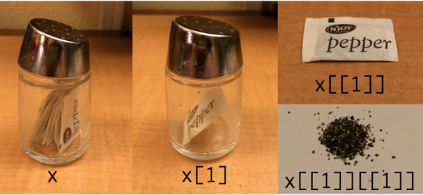

```{r,echo=FALSE,message = FALSE, warning = FALSE}
rm(list=objects()) # start with a clean workspace
source("knitr_tweaks.R")
library(lsr,quietly = TRUE)
library(tidyverse,quietly = TRUE)
```

> He divided the universe in forty categories or classes, these being further subdivided into differences, which was then subdivided into species. He assigned to each class a monosyllable of two letters; to each difference, a consonant; to each species, a vowel. For example: `de`, which means an element; `deb`, the first of the elements, fire; `deba`, a part of the element fire, a flame. … The words of the analytical language created by John Wilkins are not mere arbitrary symbols; each letter in them has a meaning, like those from the Holy Writ had for the Cabbalists. <br>
> &nbsp;&nbsp;&nbsp;&nbsp;&nbsp;&nbsp;--Jorge Luis Borges, [The Analytical Language of John Wilkins](https://en.wikipedia.org/wiki/The_Analytical_Language_of_John_Wilkins)


## Factors

As psychological research methodology classes are at pains to point out, the data we analyse come in different kinds. Some variables are inherently *quantitative* in nature: response time (RT) for instance, has a natural interpretation in units of time. So when I defined a response time variable in the previous section, I used a numeric vector.  To keep my variable names concise, I'll define the same variable again using the conventional RT abbreviation:

```{r}
RT <- c(420, 619, 550, 521, 1003, 486, 512, 560, 495, 610)
```

A response time of 1500 milliseconds is indeed 400 milliseconds slower than a response time of 1100 milliseconds, so addition and subtraction are meaningful operations. Similarly, 1500 milliseconds is twice as long as 750 milliseconds, so multiplication and division are also meaningful. That's not the case for other kinds of data, and this is where **factors** can be useful...

### Unordered factors

Some variables are inherently *nominal* in nature. If I recruit participants in an online experiment I might see that their place of residence falls in one of several different regions. For simplicity, let's imagine that my study is designed to sample people from one of four distinct geographical regions: the United States, India, China or the European Union, which I'll represent using the codes `"us"`, `"in"`, `"ch"` and `"eu"`. My first thought would be to represent the data using a character vector:

```{r}
region_raw <- c("us","us","us","eu","in","eu","in","in","us","in")
```

This seems quite reasonable, but there's a problem: as it happens there is nobody from China in this sample. So if I try to construct a frequency table of these data -- which I can do using the `table()` function in R -- the answer I get omits China entirely:

```{r}
table(region_raw)
```

Intuitively it feels like there should be a fourth entry here, indicating that we have 0 participants from China. R has a natural tool for representing this idea, called a **factor**. First, we'll create a new variable using the `factor()` function that contains the same information but represents it as a factor:

```{r}
region <- factor(region_raw)
region
```

This looks a much the same, and not surprisingly R still doesn't know anything about the possibility of participants from China. However, notice that the bottom of the output lists the *levels* of the factor. The levels of a factor specify the set of values that variable could have taken. By default, `factor()` tries to guess the levels using the raw data, but we can override that manually, like this:

```{r}
region <- factor(region_raw, levels = c("ch","eu","in","us"))
region
```

Now when we tabulate the `region` variable, we obtain the right answer:

```{r}
table(region)
```

Much nicer.

### Ordered factors

There are two different types of factor in R. Until now we have been discussing *unordered* factors, in which the categories are purely nominal and there is no notion that the categories are arranged in any particular order. However, many psychologically important variables are inherently *ordinal*. Questionnaire responses often take this form, where participants might be asked to endorse a proposition using verbal categories such as *"strongly agree", "agree", "neutral", "disagree"* and *"strongly disagree"*. The five response categories can't be given  any sensible numerical values^[For example, suppose we decide to assign them the numbers 1 to 5. If we take these numbers literally, we're implicitly assuming that is the psycholigical difference between *"strongly agree"* and *"neutral"* is the same in "size" as the difference between *"agree"* and *"disagree"*. In many situations this is probably okay to a first approximation, but in general it feels very strange.] but they can be ordered in a sensible fashion. In this situation we may want to represent the responses as an **ordered factor**. 

To give you a sense of how these work in R, suppose we've been unfortunate enough to be given a data set that encodes ordinal responses numerically. In my experience that happens quite often. Let's suppose the original survey asked people how strongly they supported a polticial policy. Here we have a variable consisting of Likert scale data, where (let's suppose) in the original questionnaire 1 = *"strongly agree"* and 7 = *"strongly disagree"*,

```{r}
support_raw <- c(1, 7, 3, 4, 4, 4, 2, 6, 5, 5)
```

We can convert this to an ordered factor by specifying `ordered = TRUE` when we call the `factor()` function, like so:

```{r}
support <- factor( 
  x = support_raw,            # the raw data
  levels = c(7,6,5,4,3,2,1),  # strongest agreement is 1, weakest is 7
  ordered = TRUE              # and it’s ordered
)
support
```

Notice that when we print out the ordered factor, R explicitly tells us what order the levels come in. 

Because I wanted to order my levels in terms of *increasing* strength of endorsement, and because a response of 1 corresponded to the strongest agreement and 7 to the strongest disagreement, it was important that I tell R to encode 7 as the lowest value and 1 as the largest. Always check this when creating an ordered factor: it’s very easy to accidentally encode your data with the levels reversed if you’re not paying attention. In any case, note that we can (and should) attach meaningful names to these factor levels by using the `levels` function, like this:
```{r}
levels(support) <- c( 
  "strong disagree", "disagree", "weak disagree",
  "neutral", "weak agree", "agree", "strong agree" 
)
support
```

A nice thing about ordered factors is that some analyses in R automatically treat ordered factors differently to unordered factors, and generally in a way that is more appropriate for ordinal data. 

## Data frames

We now have three variables that we might plausibly have encountered as the result of some study, `region`, `support` and `RT`.^[Admittedly it would be a strange study that produced only these three variables, but I hope you'll forgive the lack of realism on this point.] At the moment, R has no understanding of how these variables are related to each other. Quite likely they're ordered the same way, so that the data stored in `region[1]`, `support[1]` and `RT[1]` all come from the same person. That would be sensible, but R is a robot `r emo::ji("robot")` and does not possess common sense. To help a poor little robot out (and to make our own lives easier), it's nice to organise these three variable into a tabular format. We saw this in the last section, in which the AFL data was presented as a table. This is where **data frames** -- and the tidyverse analog **tibbles** -- are very useful. 

### Making a data frame

So how do we create a data frame (or tibble)? One way we’ve already seen: if we import our data from a CSV file, R will create one for you. A second method is to create a data frame directly from some existing variables using the `data.frame` function. In real world data analysis this method is less common, but it's very helpful for understanding what a data frame actually is, so that's what we'll do in this section.

Manually constructing a data frame is simple. All you have to do when calling `data.frame` is type a list of variables that you want to include in the data frame. If I want to store the variables from my experiment in a data frame called `dat` I can do so like this:

```{r}
dat <- data.frame(region, support, RT)
dat
```

Note that `dat` is a self-contained variable. Once created, it no longer depends on the variables from which it was constructed. If we make changes to the original `RT` variable, these will not influence the copy in `dat` (or vice versa). So for the sake of my sanity I'm going to remove all the originals:

```{r}
rm(region_raw, region, support_raw, support, RT)  
who() 
```

As you can see, our workspace has only a single variable, a data frame called `dat`. In this example I constructed the data frame manually so that you can see *how* a data frame is built from a set of variables, but in most real life situations you'd probably load your data frame directly from a CSV file or similar.

### Making a tibble
 
Constructing a tibble from raw variables is essentially the same as constructing a data frame, and the function we use to do this is `tibble`. If I hadn't deleted all the raw variables in the previous section, this command would work:

```{r,eval = FALSE}
tib <- tibble(region, support, RT)
```

Alas they are gone, and I will have to try a different method. Fortunately, I can **coerce** my existing data frame `dat` into a tibble using the `as_tibble()` function, and use it to create a tibble called `tib`. I'm very imaginative `r emo::ji("grinning")`

```{r}
tib <- as_tibble(dat)
tib
```

Coercion is an important R concept, and one that we'll talk about again at the end of this section. In the meantime, there are some nice things to note about the output when we print `tib`. It states that the variable is a tibble with 10 rows and 3 columns. Underneath the variable names it tells you what type of data they store: `region` is a factor (`<fct>`), `support` is an ordered factor (`<ord>`) and RT is numeric (`<dbl>`, short for "double")^[The origin of the term "double" comes from [double precision floating point](https://en.wikipedia.org/wiki/Double-precision_floating-point_format) the format in which numeric variables are represented internally]. 

### Tibbles are data frames

Under the hood, tibbles are essentially the same thing as data frames and are designed to behave the same way. In fact, if we use the `class()` function to see what R thinks `tib` really is...
```{r}
class(tib)
```
... it agrees that in addition to being a tibble, `tib` is also a data frame! We can check this more directly using the `is.data.frame()` function: 
```{r}
is.data.frame(tib)
```

That being said, there are one or two differences between tibbles and pure data frames. For the most part, my impression has been that whenever they differ, the behaviour of tibbles tends to be more intuitive. With this in mind, although I'll tend to use the terms "data frame" and "tibble" interchangeably in these notes, for the rest of these notes I'm going to work with tibbles like `tib` rather than pure data frames like `dat`. 

### Using the `$` operator

At this point our workspace contains a data frame called `dat`, a tibble called `tib`, but no longer contains the original variables. That's okay because the tibble (data frame) is acting as a container that keeps them in a nice tidy rectangular shape. Conceptually this is very nice, but now we have a practical question ... how do we get information out again? There are two qualitatively different ways to do this,^[Technically this is a lie: there are many more ways to do this, but let's not make this any more difficult than it needs to be, yeah?] reflecting two different ways to think about your data:

- Your data set is a *list of variables* (...use `$`)
- Your data set is a *table of values* (...use `[ ]`)

Both perspectives are valid, and R allows you to work with your data both ways. 

To start with, let's think of `tib` as a list of variables. This was the perspective we took when constructing `dat` in the first place: we took three different vectors (`region`, `support`, `RT`) and bound them together into a data frame, which we later coerced into the tibble `tib`. From this perspective, what we want is an operator that will extract one of those variables for us. This is the role plaed by `$`. If I want to refer to the `region` variable contained *within* the `tib` tibble, I would use this command:

```{r}
tib$region
```

As you can see, the output looks exactly the same as it did for the original variable: `tib$region` *is a vector* (an unordered factor in this case), and we can refer to an element of that vector in the same way we normally would:

```{r}
tib$region[1]
```

Conceptually, the metaphor here is `dataset$variable[value]`. The table below illustrates this by showing what type of output you get with different commands:


```{r,echo=FALSE}
df <- tibble(
  "data frame command" = c("dat", "dat$RT", "dat$RT[1]"),
  "data frame output" = c("data frame", "vector", "element"),
  "tibble command" = c("tib", "tib$RT", "tib$RT[1]"),  
  "tibble output" = c("tibble", "vector", "element")
)
knitr::kable(df)
rm(df)
```  
  
As you can see, the `$` operator works the same way for pure data frames as for tibbles. This is not quite the case for when using square brackets `[ ]`, as the next section demonstrates... 
  

### Using square brackets

The second way to think about a tibble is to treat it as a fancy table. There is something  appealing about this, because it emphasises the fact that the data set has a *case by variable* structure:
```{r}
tib
```
In this structure each row is a person, and each column is a variable. The square bracket notation allows you to refer to entries in the data set by their row and column number (or name). As such, the reference looks like this:
```
dataset[row,column]
```
R allows you to select multiple rows and colummns. For instance if you set `row` to be `1:3` then R will return the first three cases. Here is an example where we select the first three rows and the first two columns:
```{r}
tib[1:3, 1:2]
```

If we omit values for the rows (or columms) *while keeping the comma* then R will assume you want all rows (or colummns). So this returns every row in `tib` but only the first two columns:
```{r}
tib[, 1:2]
```

An important thing to recognise here is that -- for tibbles -- the metaphor underpinning the square bracket system is that your data have a rectangular shape that is imposed by the fact that your variable is a tibble, and no matter what you do with the square brackets the result will **always remain a tibble**. If I select just one row...

```{r}
tib[5,]
```

the result is a tibble. If I select just one column...

```{r}
tib[,3]
```

the result is a tibble. Even if I select a single value...

```{r}
tib[5,3]
```

the result is a tibble. For the square bracket system the rule is very simple: **tibbles stay tibbles**

Annoyingly, this is not the case for a pure data frame like `dat`. For a pure data frame, any time it is possible for R to treat the result as something else, it does: if I were to use the same commands for the data frame `dat`, the results would be different in some cases. This has caused my students (and myself) no end of frustration over the years because everyone forgets about this particular property of data frames and stuff breaks. In the original version of these notes published in *Learning Statistics with R* I had a length explanation of this behaviour. Nowadays I just encourage people to use tibbles instead. For what it's worth, if you are working with pure data frames, here's a summary of what to expect:

```{r,echo=FALSE}
df <- tibble(
  "data frame command" = c("dat[1,1]", "dat[1,]", "dat[,1]", "dat[2:3,]","dat[,2:3]"),
  "data frame output" = c("element", "data frame", "vector", "data frame", "data frame"),
  "tibble command" = c("tib[1,1]", "tib[1,]", "tib[,1]", "tib[2:3,]","tib[,2:3]"),  
  "tibble output" = c("tibble", "tibble", "tibble", "tibble", "tibble")
)
knitr::kable(df)
rm(df)
```
  
I **like** tibbles.^[Just FYI: you can make a pure data frame behave like a tibble. If you use `dat[,1,drop=FALSE]` you can suppress this weird thing and make R return a one-column data frame instead of a vector, but that command is so unbearably cumbersome that everyone forgets to use it.]


## Matrices

Data frames and tibbles are mostly used to describe data that take the form of a *case by variable* structure: each row is a case (e.g., a participant) and each column is a variable (e.g., measurement). Case by variable structures are fundamentally asymmetric because the rows and columns have qualitatively different meaning. Two participants who provide data will always provide data in the same format (if they don't then you can't organise the data this way), but two variables can be different in many different ways: one column might be numeric, another is a factor, yet another might contains dates. Many psychological data sets have this characteristic. Others do not, so it is worth talking about a few other data structures that arise quite frequently!

Much like a data frame, a **matrix** is basically a big rectangular table of data, and there are similarities between the two. However, matrices treat columns and rows in the same fashion, and as a consequence every entry in a matrix has to be of the same type (e.g. all numeric, all character, etc). Let's create a matrix using the *row bind* function, `rbind`, which combines multiple vectors in a row-wise fashion:

```{r}
row1 <- c(2, 3, 1)          # create data for row 1
row2 <- c(5, 6, 7)          # create data for row 2
mattie <- rbind(row1, row2) # row bind them into a matrix
mattie
```

Notice that when we bound the two vectors together R turned the names of the original variables into row names.^[We could delete these if we wanted by typing `rownames(mattie)<-NULL`, but I generally prefer having meaningful names attached to my variables, so I’ll keep them.] To keep things fair, let's add some exciting column names as well:

```{r}
colnames(mattie) <- c("col1", "col2", "col3")
mattie
```

### Matrix indexing

You can use square brackets to subset a matrix in much the same way that you can for data frames, again specifying a row index and then a column index. For instance, `mattie[2,3]` pulls out the entry in the 2nd row and 3rd column of the matrix (i.e., `7`), whereas `mattie[2,]` pulls out the entire 2nd row, and `mattie[,3]` pulls out the entire 3rd column. However, it’s worth noting that when you pull out a column, R will print the results horizontally, not vertically.^[The reason for this relates to how matrices are implemented. The original matrix `mattie` is treated as a *two-dimensional* object, containing two rows and three columns. However, whenever you pull out a single row or a single column, the result is considered to be a vector, which has a *length* but doesn't have dimensions. Unless you explictly coerce the vector into a matrix, R doesn't really distinguish between row vectors and column vectors. This has implications for how matrix algebra is implemented in R (which I’ll admit I initially found odd). When multiplying a matrix by a vector using the `%*%` operator, R will attempt to interpret the vector as either a row vector or column vector, depending on whichever one makes the multiplication work. That is, suppose $\mathbf{M}$ is  $2\times 3$ matrix, and $v$ is a $1\times 3$ row vector. Mathematically the matrix multiplication $\mathbf{M}v$ doesn't make sense since the dimensions don’t conform, but you can multiply by the corresponding column vector, $\mathbf{M}v^T$. So, if I set `v <- mattie[2,]`, the object that R returns doesn't technically have any *dimensions* only a *length*. So even though `v` was behaving like a row vector when it was part of `mattie`, R has forgotten that completely and only knows that `v` is length three. So when I try to calculate `mattie %*% v`, which you’d think would fail because I didn't transpose `v`, it actually works. In this context R treated `v` as if it were a column vector for the purposes of matrix multiplication. Note that if both objects are vectors, this leads to ambiguity since $vv^T$ (inner product) and $v^Tv$ (outer product) yield different answers. In this situation `v %*% v` returns the inner product. You can obtain the outer product with `outer(v,v)`. The help documentation may come in handy!] 
```{r}
mattie[2,]
mattie[,3]
```
This can be a little confusing for novice users: because it is no longer a two dimensional object R treats the output as a regular vector.^[You can suppress this behaviour by using a command like `mattie[,3,drop=FALSE]`. It's unpleasant though. Also be warned: data frames do this too when you select one column using square brackets. Tibbles don't. One of the reasons I like tibbles actually.]


### Matrices vs data frames

As mentioned above difference between a data frame and a matrix is that, at a fundamental level, a matrix really is just *one* variable: it just happens that this one variable is formatted into rows and columns. If you want a matrix of numeric data, every single element in the matrix *must* be a number. If you want a matrix of character strings, every single element in the matrix *must* be a character string. If you try to mix data of different types together, then R will either complain or try to transform the matrix into something unexpected. To give you a sense of this, let's do something silly and convert one element of `mattie` from the number `5` to the character string `"five"`...
```{r}
mattie[2,2] <- "five" 
mattie
```
Oh no I broke `mattie` -- she's all text now! I'm so sorry `mattie`, I still love you `r emo::ji("heart")` 

### Other ways to make a matrix

When I created `mattie` I used the `rbind` command. Not surprisingly there is also a `cbind` command that combines vectors column-wise rather than row-wise. There is also a `matrix` command that you can use to specify a matrix directly:
```{r}
matrix(
  data = 1:12, # the values to include in the matrix
  nrow = 3,    # number of rows
  ncol = 4     # number of columns
)
```
The result is a $3\times 4$ matrix of the numbers 1 to 12, listed column-wise.^[I won't go into details, but note that you can refer the elements of a matrix by specifying only a single index. For a $3\times 4$ matrix `M`,  `M[2,2]` and `M[5]` refer to the same cell. This method of indexing assumes column-wise ordering regardless of whether the matrix `M` was originally created in column-wise or row-wise fashion.] If you need to create a matrix row-wise, you can specify `byrow = TRUE` when calling `matrix()`.

## Arrays

When doing data analysis, we often have reasons to want to use higher dimensional tables (e.g., sometimes you need to cross-tabulate three variables against each other). You can’t do this with matrices, but you can do it with arrays. An **array** is just like a matrix, except it can have more than two dimensions if you need it to. In fact, as far as R is concerned a matrix is just a special kind of array, in much the same way that a data frame is a special kind of list. I don’t want to talk about arrays too much, but I will very briefly show you an example of what a three dimensional array looks like.

```{r}
arr <- array(
  data = 1:24, 
  dim = c(3,4,2)
  )
arr
```

Of course, calling an array `arr` just makes me think of pirates `r emo::ji("skull_and_crossbones")`.

### Array indexing

Array indexing is a straightforward generalisation of matrix indexing, so the same logic applies. Since `arr` is a three-dimensional $3 \times 4 \times 2$ array, we need three indices to specify an element:
```{r}
arr[2,3,1]
```
Omitted indices have the same meaning that they have for matrices, so `arr[,,2]` is a two dimensional slice through the array, and as such R recognises it as a matrix even though the full three dimensional array `arr` does not count as one.^[To see this, compare `is.matrix(arr)` to `is.matrix(arr[,,2])`] Here's what `arr[,,2]` returns:
```{r}
arr[,,2]
```


<!--
but you probably won't be surprised to note that this also works...
```{r}
arr[8]
```
-->

### Array names

As with other data structures, arrays can have names for specific elements. In fact, we can assign names to each of the *dimensions* too. For instance, suppose we have another array -- that we affectionately call `cubie` `r emo::ji("box")` -- it is also a three dimensional array, but that has the shape that it does because it represents a (3 genders) $\times$ (4 seasons) $\times$ (2 times) structure. We could specify the dimension names for `cubie` like this:
```{r}
cubie <- array(
  data = 1:24, 
  dim = c(3,4,2), 
  dimnames = list(
    "genders" = c("male", "female", "nonbinary"),
    "seasons" = c("summer", "autumn", "winter", "spring"),
    "times" = c("day", "night")
    )
  )
cubie
```
I find the output for `cubie` easier to read than the one for `arr` -- it's usually a good idea to label your arrays! Plus, it makes it a little easier to extract information from them too, since you can refer to elements by names. So if I just wanted to take a slice through the array corresponding to the `"nonbinary"` values, I could do this:
```{r}
cubie["nonbinary",,]
```


## Lists

The next kind of data I want to mention are lists. Lists are an extremely fundamental data structure in R, and as you start making the transition from a novice to a savvy R user you will use lists all the time. Most of the advanced data structures in R are built from lists (e.g., data frames are actually a specific type of list), so it’s useful to have a basic understanding of them.

Okay, so what is a list, exactly? Like data frames, lists are just “collections of variables.” However, unlike data frames – which are basically supposed to look like a nice “rectangular” table of data – there are no constraints on what kinds of variables we include, and no requirement that the variables have any particular relationship to one another. In order to understand what this actually means, the best thing to do is create a list, which we can do using the `list` function. If I type this as my command:

```{r}
starks <- list(
  parents = c("Eddard", "Catelyn"),
  children = c("Robb", "Jon", "Sansa", "Arya", "Brandon", "Rickon"),
  alive = 8
)
```

I create a list `starks` that contains a list of the various characters that belong to House Stark in George R. R. Martin's *A Song of Ice and Fire* novels. Because Martin does seem to enjoy killing off characters, the list starts out by indicating that all eight are currently alive (at the start of the books obviously!) and we can update it if need be. When a character dies, I might do this:

```{r}
starks$alive <- starks$alive - 1
starks
```

I can delete whole variables from the list if I want. For instance, I might just give up on the parents entirely:

```{r}
starks$parents <- NULL
starks
```

You get the idea, I hope. The key thing with lists is that they're flexible. You can construct a list to map onto all kinds of data structures and do cool things with them. At a fundamental level, many of the more advanced data structures in R are just fancy lists.


### Indexing lists

In the example above we used `$` to extract named elements from a list, in the same fashion that we would do for a data frame or tibble. It is also possible to index a list using square brackets, though it takes a little effort to get used to. The elements of a list can be extracted using single brackets (e.g., `starks[1]`) or double brackets (e.g., `starks[[1]]`). To see the difference between the two, notice that the single bracket version returns a list *containing* only a single vector
```{r}
starks[1]
```
This output is a list that contains one vector `starks$children`. In contrast, the double bracketed version returns the `children` vector itself:
```{r}
starks[[1]]
```

If this seems complicated and annoying... well, yes. Yes it is!

I find it helps me to think of the list as a container. When we use single brackets, the result is still inside its container; when we use double brackets we remove it from the container. This intuition is illustrated nicely in the image below, [tweeted](https://twitter.com/hadleywickham/status/643381054758363136) by Hadley Wickham:



In this example `x` is a container (list) containing many pepper sachets (elements). When we type `x[1]` we keep only one of the sachets of pepper, but it's still inside the container. When we type `x[[1]]` we take the sachet out of the container.

The final panel highlights how lists can become more complicated.^[Speaking of complications... Under the hood, data frames and tibbles are secretly lists, so you can use the list indexing methods for them and so, for example, `dat[[3]]` is the same as `dat$RT`. Probably best not to worry too much about that detail right now `r emo::ji("grimace")`] Lists are just fancy containers, and there's no reason why lists can't contain other lists. In the pepper shaker scenario, if each sachet is itself a list, we would need to type `x[[1]][[1]]` to extract the tasty, tasty pepper! `r emo::ji("pepper")`

## Dates

Dates (and time) are very annoying types of data. To a first approximation we can say that there are 365 days in a year, 24 hours in a day, 60 minutes in an hour and 60 seconds in a minute, but that’s not quite correct. The length of the solar day is not exactly 24 hours, and the length of solar year is not exactly 365 days, so we have a complicated system of corrections that have to be made to keep the time and date system working. On top of that, the measurement of time is usually taken relative to a local time zone, and most (but not all) time zones have both a standard time and a daylight savings time, though the date at which the switch occurs is not at all standardised. So, as a form of data, times and dates are just awful to work with. Unfortunately, they’re also important. Sometimes it’s possible to avoid having to use any complicated system for dealing with times and dates. Often you just want to know what year something happened in, so you can just use numeric data: in quite a lot of situations something as simple as declaring that `this_year` is `r format(Sys.Date(),"%Y")`, and it works just fine. If you can get away with that for your application, this is probably the best thing to do. However, sometimes you really do need to know the actual date. Or, even worse, the actual time. In this section, I’ll very briefly introduce you to the basics of how R deals with date and time data. As with a lot of things in this chapter, I won’t go into details: the goal here is to show you the basics of what you need to do if you ever encounter this kind of data in real life. And then we’ll all agree never to speak of it again.

To start with, let’s talk about the date. As it happens, modern operating systems are very good at keeping track of the time and date, and can even handle all those annoying timezone issues and daylight savings pretty well. So R takes the quite sensible view that it can just ask the operating system what the date is. We can pull the date using the `Sys.Date` function:

```{r}
today <- Sys.Date()  # ask the operating system for the date
print(today)         # display the date
```

Okay, that seems straightforward. But, it does rather look like today is just a character string, doesn’t it? That would be a problem, because dates really do have a quasi-numeric character to them, and it would be nice to be able to do basic addition and subtraction with them. Well, fear not. If you type in `class(today)`, R will tell you that the `today` variable is a `"Date"` object. What this means is that, hidden underneath this text string, R has a numeric representation.^[Date objects are coded internally as the number of days that have passed since January 1, 1970.] What that means is that you  can in fact add and subtract days. For instance, if we add `1` to `today`, R will print out the date for tomorrow:
```{r}
today + 1
```
Let’s see what happens when we add 365 days:
```{r}
today + 365
```
R provides a number of functions for working with dates, but I don’t want to talk about them in any detail, other than to say that the **lubridate** package (part of the tidyverse) makes things a lot easier than they used to be. A little while back I wrote a [blog post about lubridate](http://djnavarro.net/post/2018-05-02-lubridate/) and may fold it into these notes one day.

<!--

## Variable class

As we’ve seen, R allows you to store different kinds of data. In particular, the variables we’ve defined so far have either been character data (text), numeric data, or logical data. This is quite useful, but notice that it means that R makes a big distinction between `5` and `"5"`. Without quote marks, R treats `5` as the number five, and will allow you to do calculations with it. With the quote marks, R treats `"5"` as the textual character five, and doesn’t recognise it as a number any more than it recognises `"p"` or `"five"` as numbers. As a consequence, there’s a big difference between typing `x <- 5` and typing `x <- "5"`. In the former, we’re storing the number `5`; in the latter, we’re storing the character `"5"`. Thus, if we try to do multiplication with the character versions, R gets stroppy
```{r, error=TRUE}
x <- "5" # x is character 
y <- "4" # y is character 
x * y
```

Okay, let’s suppose that I’ve forgotten what kind of data I stored in the variable `x` (which happens depressingly often). R provides a function that will let us find out. Actually, it provides *several* different functions that are used for different purposes. For now I only want to discuss the `class` function. The **class** of a variable is a “high level” classification, and it captures psychologically (or statistically) meaningful distinctions. For instance `"2011-09-12"` and `"my birthday"` are both text strings, but there’s an important difference between the two: one of them is a date. So it would be nice if we could get R to recognise that `"2011-09-12"` is a date, and allow us to do things like add or subtract from it. The class of a variable is what R uses to keep track of things like that. Because the class of a variable is critical for determining what R can or can’t do with it, the `class` function is very handy.

Later on, I’ll talk a bit about how you can convince R to **coerce** a variable to change from one class to another. That’s a useful skill for real world data analysis, but it’s not something that we need right now. In the meantime, the following examples illustrate the use of the `class` function:

```{r}
x <- "hello world" 
class(x)
x <- TRUE
class(x)
x <- 100
class(x)
```

-->

## Coercion

Sometimes you want to change the variable class. Sometimes when you import data from files, it can come to you in the wrong format: numbers sometimes get imported as text, dates usually get imported as text, and many other possibilities besides. Sometimes you might want to convert a data frame to a tibble or vice versa. Changing the variable in this way is called **coercion**, and the functions to coerce variables are usually given names like `as.numeric()`, `as.factor()`, `as_tibble()` and so on. We've seen some explicit examples in this chapter:

- Coercing a data frame to a tibble
- Coercing a character vector to a factor

There are many other possibilities. A common situation requiring coercion arises when you have been given a variable `x` that is *supposed* to be representing a number, but the data file that you’ve been given has encoded it as text.

```{r}
x <- c("15","19")  # the variable
class(x)           # what class is it?
```

Obviously, if I want to do mathematical calculations using `x` in its current state R wil get very sad `r emo::ji("sad")`. It thinks `x` is text and it won't allow me to do mathematics with text!  To coerce `x` from "character" to "numeric", we use the `as.numeric` function:

```{r}
x <- as.numeric(x)  # coerce the variable
class(x)            # what class is it?
x + 1               # hey, addition works!
```

Not surprisingly, we can also convert it back again if we need to. The function that we use to do this is the `as.character` function:

```{r}
x <- as.character(x)   # coerce back to text
class(x)               # check the class
```

There are of course some limitations: you can’t coerce `"hello world"` into a number because there isn’t a number that corresponds to it. If you try, R metaphorically shrugs its shoulders and declares it to be missing:

```{r}
x <- c("51", "hello world")
as.numeric(x)
```

Makes sense I suppose!

Another case worth talking about is how R handles coercion with logical variables. Coercing text to logical data using `as.logical()` is mostly intuitive. The strings `"T"`, `"TRUE"`, `"True"` and `"true"` all convert to `TRUE`, whereas `"F"`, `"FALSE"`, `"False"`, and `"false"` all become `FALSE`. All other strings convert to `NA`. When coercing from logical to test using `as.character`, `TRUE` converts to `"TRUE"` and `FALSE` converts to `"FALSE"`. 

Converting numeric values to logical data -- again using `as.logical` -- is similarly straightforward. Following the standard convention in the study of Boolean logic `0` coerces to `FALSE`. Everything else is `TRUE`. When coercing logical to numeric, `FALSE` converts to `0` and `TRUE` converts to `1`.


<!--

## Data frames revisited

Working with data frames can sometimes be complicated, so I'm going to revisit them again now that we've talked about lists. At it's core, a data frame genuinely is a list, one that just happens to have a special "rectangular" structure. However, this rectangular structure means that in addition to working with it using the `$` operator (as one would do for a list), there are some other possibilities too, based on the fact that a data frame has rows and columns. Let's return to the *In the Night Garden* data set. First, let's construct a data frame, `itng`...

```{r}
load("./data/nightgarden.Rdata")
itng <- data.frame( speaker, utterance )
itng
```

... and we'll assume the goal is to be able to select different subsets of this data set.


### The `subset` function

There are several different ways to subset a data frame in R, some easier than others. I’ll start by discussing the `subset` function, which is probably the conceptually simplest way do it. For our purposes there are three different arguments that you’ll be most interested in:

- `x`. The data frame that you want to subset.
- `subset`. A vector of logical values indicating which cases (rows) of the data frame you want to keep. By default, all cases will be retained.
- `select`. This argument indicates which variables (columns) in the data frame you want to keep. This can either be a list of variable names, or a logical vector indicating which ones to keep, or even just a numeric vector containing the relevant column numbers. By default, all variables will be retained.

Let’s start with an example in which I use all three of these arguments. Suppose that I want to subset the `itng` data frame, keeping only the utterances made by Makka-Pakka. What that means is that I need to use the `select` argument to pick out the `utterance` variable, and I also need to use the `subset` variable, to pick out the cases when Makka-Pakka is speaking (i.e., `speaker == "makka-pakka"`). Therefore, the command I need to use is this:

```{r}
df <- subset( 
  x = itng,
  subset = speaker == "makka-pakka",
  select = utterance 
  )
print( df )
```

The variable `df` here is still a data frame, but it only contains one variable (called `utterance`) and four cases. Notice that the row numbers are the same ones from the *original* data frame. It’s worth taking a moment to briefly explain this. The reason that this happens is that these "row numbers" are actually row names. When you create a new data frame from scratch R will assign each row a fairly boring row name, identical to the row number. However, when you subset the data frame, each row keeps its original row name. This can be quite useful, since – as in the current example – it provides you a visual reminder of what each row in the new data frame corresponds to in the original data frame. However, if it annoys you, you can change the row names using the `rownames` function, or remove them entirely with the `rownames(df) <- NULL` command.

In any case, let’s return to the `subset` function, and look at what happens when we don’t use all three of the arguments. Firstly, suppose that I didn’t bother to specify the `select` argument. Let’s see what happens:

```{r}
subset( 
  x = itng,
  subset = speaker == "makka-pakka" 
)
```

Not surprisingly, R has kept the same cases from the original data set (i.e., rows 7 through 10), but this time it has retained all of the variables from the data frame. Equally unsurprisingly, if I don’t specify the `subset` argument, what we find is that R keeps all of the cases:

```{r}
subset( 
  x = itng,
  select = utterance 
)
```

Again, it’s important to note that this output is still a data frame: it’s just a data frame with only a single variable.

### Brackets I: Rows & columns

Throughout the book so far, whenever I’ve been subsetting a vector I’ve tended use the square brackets `[ ]` to do so. But in the previous section when I started talking about subsetting a data frame I used the `subset` function. As a consequence, you might be wondering whether it is possible to use the square brackets to subset a data frame. The answer, of course, is yes. Not only can you use square brackets for this purpose, as you become more familiar with R you’ll find that this is actually much more convenient than using `subset`. Unfortunately, the use of square brackets for this purpose is somewhat complicated, and there are a few cases that cause some confusion. So be warned: this section is more complicated than it feels like it “should” be. With that warning in place, I’ll try to walk you through it slowly. For this section, I’ll use a slightly different *In the Night Garden* data set, namely the `garden` data frame that is stored in the `nightgarden2.Rdata` file:

```{r}
load( "./data/nightgarden2.Rdata" )
garden
```

As you can see, the `garden` data frame contains three variables and five cases, and this time around I’ve used the `rownames` function to attach slightly verbose labels to each of the cases. Moreover, let’s assume that what we want to do is to pick out rows 4 and 5 (the two cases when Makka-Pakka is speaking), and columns 1 and 2 (variables `speaker` and `utterance`).

How shall we do this? As usual, there’s more than one way. The first way is based on the observation that, since a data frame is rectangular, every element in the data frame has a *row number* and a *column number*. So, if we want to pick out a single element, we have to specify the row number *and* a column number within the square brackets. By convention, the row number comes first. So, for the data frame above, which has five rows and three columns, the numerical indexing scheme looks like this:

```{r,echo=FALSE,results="asis"}
tmp <- matrix(NA, 5, 3)
for(i in 1:5) {
  for(j in 1:3) {
    tmp[i,j] <- paste0("[",i,",",j,"]")
  }
}
rownames(tmp) <- paste("row", 1:5)
colnames(tmp) <- paste("col", 1:3)
print(knitr::kable(tmp))
rm(tmp)
```

If I want the 3rd case of the 2nd variable, what I would type is `garden[3,2]`, and R would print out some output showing that this element corresponds to the utterance `"ee"`. However, let’s hold off from actually doing that for a moment, because there’s something slightly counterintuitive about the specifics of what R does under those circumstances. Instead, let’s aim to solve our original problem, which is to pull out two rows (4 and 5) and two columns (1 and 2). This is fairly simple to do, since R allows us to specify multiple rows and multiple columns. So let’s try that:

```{r}
garden[ 4:5, 1:2 ]
```

Clearly, that’s exactly what we asked for: the output here is a data frame containing two variables and two cases. Note that I could have gotten the same answer if I’d used the `c` function to produce my vectors rather than the `:` operator. That is, the following command is equivalent to the last one:

```{r}
garden[ c(4,5), c(1,2) ]
```

It’s just not as pretty. However, if the columns and rows that you want to keep don’t happen to be next to each other in the original data frame, then you might find that you have to resort to using commands like `garden[ c(2,4,5), c(1,3) ]` to extract them.

A second way to do the same thing is to use the names of the rows and columns. That is, instead of using the row numbers and column numbers, you use the character strings that are used as the labels for the rows and columns. To apply this idea to our `garden` data frame, we would use a command like this:
```{r}
garden[ c("case.4", "case.5"), c("speaker", "utterance") ]
```

Once again, this produces exactly the same output, so I haven’t bothered to show it. Note that, although this version is more annoying to type than the previous version, it’s a bit easier to *read*, because it’s often more meaningful to refer to the elements by their names rather than their numbers. Also note that you don’t have to use the same convention for the rows and columns. For instance, I often find that the variable names are meaningful and so I sometimes refer to them by name, whereas the row names are pretty arbitrary so it’s easier to refer to them by number. In fact, that’s more or less exactly what’s happening with the garden data frame, so it probably makes more sense to use this as the command:
```{r}
garden[ 4:5, c("speaker", "utterance") ]
```
Again, the output is identical.

Finally, both the rows and columns can be indexed using logicals vectors as well. For example, although I claimed earlier that my goal was to extract cases 4 and 5, it’s pretty obvious that what I really wanted to do was select the cases where Makka-Pakka is speaking. So what I could have done is create a logical vector that indicates which cases correspond to Makka-Pakka speaking:

```{r}
garden$speaker == "makka-pakka"
```

As you can see, the 4th and 5th elements of this vector are `TRUE` while the others are `FALSE`. So I can use this vector to select the rows that I want to keep:
```{r}
garden[ garden$speaker == "makka-pakka", c("speaker", "utterance") ]
```
And of course the output is, yet again, the same.

### Brackets II: Some elaborations

There are two fairly useful elaborations on this “rows and columns” approach that I should point out. Firstly, what if you want to keep all of the rows, or all of the columns? To do this, all we have to do is leave the corresponding entry blank, but it is crucial to remember to *keep the comma!* For instance, suppose I want to keep all the rows in the `garden` data, but I only want to retain the first two columns. The easiest way do this is to use a command like this:

```{r}
garden[ , 1:2 ]
```


Alternatively, if I want to keep all the columns but only want the last two rows, I use the same trick, but this time I leave the second index blank. So my command becomes:

```{r}
garden[ 4:5, ]
```

The second elaboration I should note is that it’s still okay to use negative indexes as a way of telling R to delete certain rows or columns. For instance, if I want to delete the 3rd column, then I use this command:

```{r}
garden[ , -3 ]
```


whereas if I want to delete the 3rd row, then I’d use this one:

```{r}
garden[ -3,  ]
```

So that’s nice.

### Brackets III:  “dropping”

At this point some of you might be wondering why I’ve been so terribly careful to choose my examples in such a way as to ensure that the output always has are multiple rows and multiple columns. The reason for this is that I’ve been trying to hide the somewhat curious “dropping” behaviour that R produces when the output only has a single column. I’ll start by showing you what happens, and then I’ll try to explain it. Firstly, let’s have a look at what happens when the output contains only a single row:

```{r}
garden[ 5, ]
```

This is exactly what you’d expect to see: a data frame containing three variables, and only one case per variable. Okay, no problems so far. What happens when you ask for a single column? Suppose, for instance, I try this as a command:

```{r,eval=FALSE}
garden[ , 3 ]
```

Based on everything that I’ve shown you so far, you would be well within your rights to expect to see R produce a data frame containing a single variable and five cases. After all, that is what the `subset` command does in this situation, and it’s pretty consistent with everything else that I’ve shown you so far about how square brackets work. In other words, you should expect to see this:
```{r,echo=FALSE}
garden[,3,drop=FALSE]
```
However, that is emphatically not what happens. What you actually get is this:
```{r}
garden[, 3]
```

That output is not a *data frame at all!* That’s just an ordinary numeric vector containing 5 elements. What’s going on here is that R has “noticed” that the output that we’ve asked for doesn’t really “need” to be wrapped up in a data frame at all, because it only corresponds to a single variable. So what it does is “drop” the output from a data frame *containing* a single variable, “down” to a simpler output that corresponds to that variable. This behaviour is convenient for day to day usage once you’ve become familiar with it – and I suppose that’s the real reason why R does this – but there’s no escaping the fact that it is *deeply* confusing to novices. It’s especially confusing because the behaviour appears only for a very specific case: (a) it only works for columns and not for rows, because the columns correspond to variables and the rows do not, and (b) it only applies to the “rows and columns” version of the square brackets, and not to the `subset` function, or to the “just columns” use of the square brackets (next section). As I say, it’s very confusing when you’re just starting out. For what it’s worth, you can suppress this behaviour if you want, by setting `drop = FALSE` when you construct your bracketed expression. That is, you could do something like this:
```{r}
garden[, 3, drop=FALSE]
```
I suppose that helps a little bit, in that it gives you some control over the dropping behaviour, but I’m not sure it helps to make things any easier to understand. Anyway, that’s the “dropping” special case. Fun, isn’t it?

### Brackets IV: Columns only


As if the weird “dropping” behaviour wasn’t annoying enough, R actually provides a completely different way of using square brackets to index a data frame. Specifically, if you *only* give a single index, R will assume you want the corresponding columns, not the rows. Do not be fooled by the fact that this second method also uses square brackets: it behaves differently to the “rows and columns” method that I’ve discussed in the last few sections. Let’s start with the following command:

```{r}
garden[ 1:2 ]
```


As you can see, the output gives me the first two columns, much as if I’d typed `garden[,1:2]`. It doesn’t give me the first two rows, which is what I’d have gotten if I’d used a command like `garden[1:2,]`. Not only that, if I ask for a single column, R does not drop the output:

```{r}
garden[3]
```

As I said earlier, the only case where dropping occurs by default is when you use the “row and columns” version of the square brackets, and the output happens to correspond to a single column. However, if you really want to force R to drop the output, you can do so using the “double brackets” notation:

```{r}
garden[[3]]
```

Note that R will only allow you to ask for one column at a time using the double brackets. If you try to ask for multiple columns in this way, you get completely different behaviour, which may or may not produce an error, but definitely won’t give you the output you’re expecting. The only reason I’m mentioning it at all is that you might run into double brackets when doing further reading, and a lot of books don’t explicitly point out the difference between `[ ]` and `[[ ]]`. 

### Whyyyyy?

Okay, for those few readers that have persevered with this section long enough to get here without having set fire to somethin, I should explain why R has these two different systems for subsetting a data frame (i.e., “row and column” versus “just columns”), and why they behave so differently to each other. I’m not 100% sure about the motivation since I never did manage to read through very much of the  references that describe the early development of R, but I think the answer relates to the fact that data frames are actually a very strange hybrid of two different kinds of thing. At a low level, a data frame is a *list*. I can demonstrate this to you by overriding the normal `print` function and forcing R to print out the garden data frame using the default print method (see later!) rather than the special one that is defined only for data frames. Here’s what we get:

```{r}
print.default( garden )
```

Apart from the weird part of the output right at the bottom, this is identical to the print out that you get when you print out a list. In other words, a data frame *is* a list. View from this “list based” perspective, it’s clear what `garden[1]` is: it’s the first variable stored in the list, namely `speaker`. In other words, when you use the “just columns” way of indexing a data frame, using only a single index, R assumes that you’re thinking about the data frame as if it were a list of variables. In fact, when you use the `$` operator you’re taking advantage of the fact that the data frame is secretly a list.

However, a data frame is more than just a list. It’s a very special kind of list where all the variables are of the same length, and the first element in each variable happens to correspond to the first “case” in the data set. That’s why no-one ever wants to see a data frame printed out in the default “list-like” way that I’ve shown in the extract above. In terms of the deeper meaning behind what a data frame is used for, a data frame really does have this rectangular shape to it:

```{r}
print( garden )
```

Because of the fact that a data frame is basically a table of data, R provides a second “row and column” method for interacting with the data frame. This method makes much more sense in terms of the "table of data" interpretation of what a data frame is, and so for the most part it’s this method that people tend to prefer. Throughout this tutorial I'll aim to stick to the “row and column” approach (though I will use `$` a lot), and avoid referring to the “just columns” approach. However, it does get used a lot in practice, so I think it’s important that this book explain what’s going on.

And now let us never speak of this again.

-->


