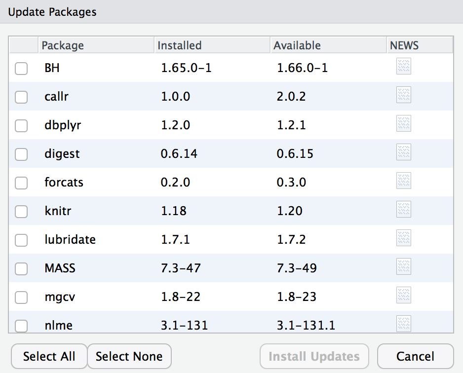

```{r,echo=FALSE}
rm(list=objects()) # start with a clean workspace
source("knitr_tweaks.R")
```


In this section I discuss R **packages**, since almost all of the functions you might want to use in R come in packages. A package is basically just a big collection of functions, data sets and other R objects that are all grouped together under a common name. Some packages are already installed when you put R on your computer, but the vast majority of them of R packages are out there on the internet, waiting for you to download, install and use them.

When I first started teaching R there wasn't anything quite as nice as Rstudio, and as a consequence I wrote a very lengthy section in my notes that explained how to do package management using raw R commands. It’s not very hard to work with packages that way, but it’s a little clunky. With this in mind, I’ll describe how to work with packages using the Rstudio tools, because they’re so much simpler. Fortunately, you’ll see that whenever you get Rstudio to do something (e.g., install a package), you’ll see the R commands that get created. I’ll explain them as we go, because I think that helps you understand what’s going on.

However, before we get started, there’s a critical distinction that you need to understand, which is the difference between having a package **installed** on your computer, and having a package **loaded** in R. There are many thousands of R packages freely available “out there” on the internet. When you install R on your computer, you don’t get all of them: only about 30 or so come bundled with the basic R installation. So right now there are about 30 packages “installed” on your computer, and many many more that are not installed. So that’s what installed means: it means “it’s on your computer somewhere”. The critical thing to remember is that just because something is on your computer doesn’t mean R can use it. In order for R to be able to use one of your 30 or so installed packages, that package must also be “loaded”. Generally, when you open up R, only a few of these packages (about 7 or 8) are actually loaded. Basically what it boils down to is this:

- A package must be **installed** (e.g., from CRAN) on your computer before it can be loaded
- A package must be **loaded** before it can be used in your R program

You only need to install a package once, but you will need to load it whenever you want to use it. This relationship is illustrated in the image below:


I'll explain this in a bit more detail as we go along.^[Every time I teach this part, there's always at least one person who notices the inconsistency... why do we use quote marks in the `install.packages("packagename")` command but not in the `library(packagename)` part. The answer is... it's complicated. The `library()` function actually works both ways, so `library("packagename")` and `library(packagename)` both work (...usually). Under the hood it is doing something clever, and using an advanced feature of R known as [non-standard evaluation](http://adv-r.had.co.nz/Computing-on-the-language.html). My advice is to ignore this completely for now. Take it on faith that something weird is happening here, and return to it at a later date.]

## The package pane

Right, let's get started. The first thing you need to do is look in the lower right hand panel in Rstudio. You’ll see a tab labelled “Packages”. Click on the tab, and you’ll see a list of packages that looks something like this:


Yours will list different packages than mine, of course, because I've installed quite a few additional packages as I've gone along. Every row in this panel corresponds to a different package, and every column is a useful piece of information about that package.^[If you’re using the command line, you can get the same information by typing `library()`.] Going from left to right, here’s what each column is telling you:

- The check box on the far left column indicates whether or not the package is loaded.
- The one word of text immediately to the right of the check box is the name of the package.
- The short passage of text next to the name is a brief description of the package.
- The number next to the description tells you what version of the package you have installed.
- The little x-mark next to the version number is a button that you can push to uninstall the package from your computer (you almost never need this).

## Loading a package

That seems straightforward enough, so let’s try loading and unloading packages. For this example, I’ll use the **foreign** package. The **foreign** package is a collection of tools that are handy when R needs to interact with files that are produced by other software packages (e.g., SPSS). It comes bundled with R, so it’s one of the ones that you have installed already, but it won’t be one of the ones loaded. Inside the **foreign** package is a function called `read.spss`. It’s a handy little function that you can use to import an SPSS data file into R, so let’s pretend we want to use it. Currently, **foreign**  isn’t loaded, so if I ask R to tell me if it knows about a function called `read.spss` it tells me that there’s no such thing...
 
```{r,echo=FALSE}
if( exists( "read.spss" )) { 
  detach("package:foreign", unload=TRUE) # just quietly, make sure it's actually gone
}
```

```{r}
exists("read.spss")
```

Now let’s load the package. In RStudio, the process is dead simple: go to the package tab, find the entry for  **foreign** package, and check the box on the left hand side. The moment that you do this, you’ll see a command like this appear in the R console...

```{r}
library("foreign")
```

The version you'll see in the console also specifies the `lib.loc` argument, which tells R where the package is stored on your computer, but mostly you don't need to worry about that yourself. 

Throughout these notes, you’ll sometimes see me typing in `library` commands. You don’t actually have to type them in yourself: you can use the RStudio package panel to do all your package loading for you. The only reason I include the `library` commands sometimes is as a reminder to you to make sure that you have the relevant package loaded. Oh, and I suppose we should check to see if our attempt to load the package actually worked. Let’s see if R now knows about the existence of the `read.spss` function...
```{r}
exists("read.spss")
```
Yep. All good.

## Unloading a package

Sometimes, especially after a long session of working with R, you may find yourself wanting to get rid of some of those packages that you’ve loaded. The RStudio package pane makes this exactly as easy as loading the package in the first place. Find the entry corresponding to the package you want to unload, and uncheck the box. When you do that for the **foreign** package, you’ll see this command appear on screen:
```{r}
detach("package:foreign", unload=TRUE)
```
And the package is unloaded. We can verify this by seeing if the `read.spss` function still `exists`:
```{r}
exists("read.spss")
```
Nope. Definitely gone.


## Dependencies

There’s a couple of other details that I want to draw your attention to. A concrete example is the best way to illustrate. One of the other packages that you already have installed on your computer is the **Matrix** package, so let’s load that one and see what happens:

```{r}
library(Matrix)
```

This is slightly more complex than the output that we got last time, but it’s not too complicated. The **Matrix** package makes use of some of the tools in the **lattice** package, and R has kept track of this dependency. So when you try to load the **Matrix** package, R recognises that you’re also going to need to have the **lattice** package loaded too. As a consequence, both packages get loaded, and R prints out a helpful little note on screen to tell you that it’s done so. 

R is pretty aggressive about enforcing these dependencies. Suppose, for example, I try to unload  **lattice** while  **Matrix** is still loaded. This is easy enough to try: all I have to do is uncheck the box next to **lattice** in the packages pane. But if I try this, here’s what happens:

```{r, error=TRUE}
detach("package:lattice", unload=TRUE)
```

R refuses to do it. This can be quite useful, since it stops you from accidentally removing something that you still need. So, if I want to remove both **Matrix** and **lattice**, I need to do it in the correct order.

## Conflicts

Something else you should be aware of. Sometimes you’ll attempt to load a package, and R will print out a message on screen telling you that something or other has been “masked”. This will be confusing to you if I don’t explain it now, and it actually ties very closely to the whole reason why R forces you to load packages separately from installing them. Here’s an example. Two package that I use a lot are called **car** and **psych**. The **car** package is short for [Companion to Applied Regression](https://us.sagepub.com/en-us/nam/an-r-companion-to-applied-regression/book233899) (an excellent book, I’ll add), and it has a number of tools that I’m quite fond of. For the most part, **car** and **psych** are unrelated to each other. They do different things, so not surprisingly almost all of the function names are different. But... there’s one exception to that. The **car** package and the **psych** package both contain a function called `logit`.^[The logit function a simple mathematical function that happens not to have been included in the basic R distribution.] This creates a naming conflict. If I load both packages into R, an ambiguity is created. If the user types in `logit(100)`, should R use the `logit` function in the **car** package, or the one in the **psych** package? The answer is: R uses whichever package you loaded most recently, and it tells you this very explicitly. Here’s what happens when I load the **car** package, and then afterwards load the **psych** package:

```{r}
library(car)
library(psych)
```

The output here is telling you that the `logit` object (i.e., function) in the **car** package is no longer accessible to you. It’s been hidden (or “masked”) from you by the one in the **psych** package^[Tip for advanced users. You can get R to use the one from the car package by using `car::logit` as your command rather than `logit`, since the `car::` part tells R explicitly which package to use. See also `:::` if you’re especially keen to force R to use functions it otherwise wouldn’t, but take care, since `:::` can be dangerous.]

## Installing packages

One of the main selling points for R is that there are thousands of packages that have been written for it, and these are all available online. So whereabouts online are these packages to be found, and how do we download and install them? There is a big repository of packages called the [Comprehensive R Archive Network](https://cran.r-project.org/) (CRAN), and the easiest way of getting and installing a new package is from one of the many CRAN mirror sites. Conveniently for us, R provides a function called `install.packages` that you can use to do this. Even more conveniently, the Rstudio team runs its own CRAN mirror and Rstudio has a clean interface that lets you install packages without having to learn how to use the `install.packages` command.

Using the Rstudio tools is, again, dead simple. In the top left hand corner of the packages panel you’ll see a button called “Install Packages”. If you click on that, it will bring up a window like the one shown below. There are a few different buttons and boxes you can play with. Ignore most of them. Just go to the line that says “Packages” and start typing the name of the package that you want. As you type, you’ll see a dropdown menu appear, listing names of packages that start with the letters that you’ve typed so far:


You can select from this list, or just keep typing. Either way, once you’ve got the package name that you want, click on the install button at the bottom of the window. When you do, you’ll see the following command appear in the R console:

```{r, eval=FALSE}
install.packages("psych")
```

This is the R command that does all the work. R then goes off to the internet, has a conversation with CRAN, downloads some stuff, and installs it on your computer. You probably don’t care about all the details of R’s little adventure on the web, but the `install.packages` function is rather chatty, so it reports a bunch of gibberish that you really aren’t all that interested in. Despite the long and tedious response, all it really means is “I’ve installed the psych package”. I find it best to humour the talkative little automaton. I don’t actually read any of this garbage, I just politely say “thanks” and go back to whatever I was doing.

### More than just CRAN

There's a little more I should say about installing packages. Most of the time the packages that you'll want to install have been made available on CRAN, so the `install.packages` function is what you'd want to use. However, that's not always true. Sometimes people write fun packages that they don't bother to submit to CRAN, and sometimes you might want to try out a package that is currently under development. In these situations, people who write packages will often make them available on sites like [GitHub](https://github.com/), [Bitbucket](https://bitbucket.org/) or [Gitlab](https://about.gitlab.com/). It's perfectly possible to install packages directly from those sites, using the **devtools** package. 

The first thing you'll need to do is install **devtools**, which is easy because that package is available on CRAN. 
```{r,eval=FALSE}
install.packages("devtools")
```
Once you have **devtools** on installed, you can use the `install_github` command to install a package directly from a GitHub repository. To give you an example of this, there's a package called `TurtleGraphics` on my [GitHub page](https://github.com/djnavarro/TurtleGraphics) that I'm going to use later.^[I really need to stress that I can't take any of the credit for this package. I really love the **TurtleGraphics** package, but it's a minor modification of [this](https://github.com/gagolews/TurtleGraphics) package ([documentation](https://github.com/gagolews/TurtleGraphics/blob/master/vignettes/TurtleGraphics.pdf)), and the original version is up on CRAN. The version on my GitHub page makes a few tweaks to it internally, fixing some bugs that were giving me some grief. I should probably submit a proper bug report at some stage!] So we can install the package directly from my GitHub page like this:

```{r,eval=FALSE}
library(devtools)
install_github("djnavarro/TurtleGraphics")
```

Just like we saw before, R responds by printing out a lot of unintelligible garbage, but in the end it works and we have a shiny new **TurtleGraphics** package to play with! And just to verify that it did work properly, let's load the package and draw a turtle:

```{r,message=FALSE}
library(TurtleGraphics)
turtle_init()
```

Yay! A turtle! We'll talk more about the turtle later.

## Updating packages

Every now and then the authors of packages release updated versions. The updated versions often add new functionality, fix bugs, and so on. It’s generally a good idea to update your packages periodically.

There’s an `update.packages` function that you can use to do this, but it’s probably easier to stick with the RStudio tool. In the packages panel, click on the “Update Packages” button. This will bring up a window that looks like the one shown below:



In this window, each row refers to a package that needs to be updated. You can to tell R which updates you want to install by checking the boxes on the left. If you’re feeling lazy and just want to update everything, click the “Select All” button, and then click the “Install Updates” button. R then prints out a lot of garbage on the screen, individually downloading and installing all the new packages. This might take a while to complete depending on how good your internet connection is. Go make a cup of coffee. Come back, and all will be well.

## Updating R

About every six months or so, a new version of R is released. You can’t update R from within RSudio (not to my knowledge, at least): to get the new version you can go to the CRAN website and download the most recent version of R, and install it in the same way you did when you originally installed R on your computer. 

This is sometimes a slightly frustrating event, because when you download the new version of R you'll probably lose all the packages that you’d downloaded and installed. That's often unavoidable, because when they release a new version of the R language, the internal features of all the packages get changed under the hood, and you need to install the new versions. The new versions will generally behave exactly the same as the old ones (unless the package author has also changed something!) but they'll sometimes run faster or whatever because of improvements to the internals of R.  

This isn't something you need to worry about when starting out. Just be aware that this happens `r emo::ji("grinning")`

## Exercises

One package I'll occasionally use for a few simple tasks is the **lsr** package that I wrote to accompany [Learning Statistics with R](https://compcogscisydney.org/learning-statistics-with-r/) 

- Install the **lsr** package
- Load the **lsr** package

There's a family of packages known as the **tidyverse** that R users rely on a *lot*. Conveniently, there's a package called **tidyverse** that loads all of the tidyverse packages all at once!

- Install the **tidyverse** 

A few other packages that you might want to install

- The **psych** and **car** packages
- The **devtools** package 

If you haven't already done so while reading this section

- Load the **devtools** package
- Use the `install_github` command to install **TurtleGraphics** from my GitHub page (i.e., `repo = "djnavarro/TurtleGraphics"`)


