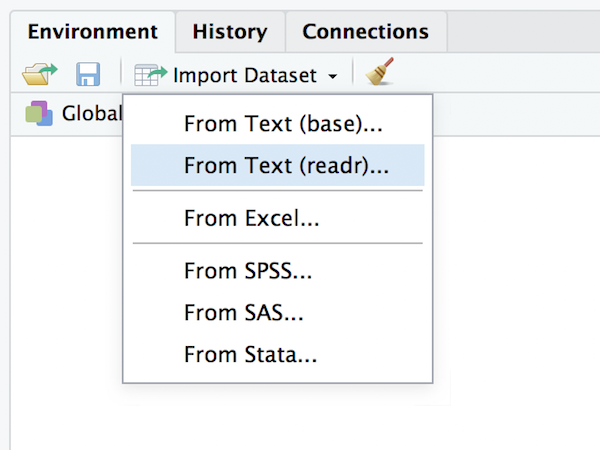
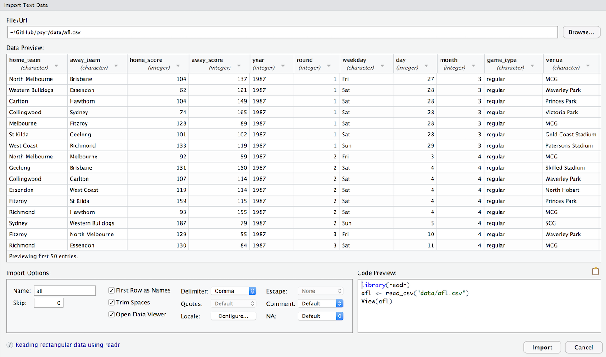

```{r,echo=FALSE}
rm(list=objects()) # start with a clean workspace
source("knitr_tweaks.R")
library(lsr,quietly = TRUE)
```

When teaching statistics and data analysis, there is a school of thought that argues that the student should be introduced to actual data as quickly as possible. In one sense I've broken that rule rather substantially. The entirety the *core toolkit* section went by without any real data, much less any data analysis.  


```{r, message = FALSE, warning = FALSE, fig.width=7}
library(tidyverse)
afl <- read_csv("./data/afl.csv")
afl

pic <- afl %>% 
  group_by(year, game_type) %>% 
  summarise(attendance = mean(attendance)) %>%
  ggplot(aes(x = year, y = attendance)) + 
  facet_wrap(~game_type) +
  geom_point() + 
  geom_smooth() 
plot(pic)
```

## The tidyverse

The first line of code in the AFL example is `library(tidyverse)`. Per the description on the [tidyverse](https://www.tidyverse.org/) website,

> The tidyverse is an opinionated collection of R packages designed for data science. All packages share an underlying design philosophy, grammar, and data structures. 


## Reading CSV data

The second line 

```{r,eval=FALSE}
afl <- read_csv("./data/afl.csv")
```


One quite commonly used data format is the humble “comma separated value” file, also called a CSV file, and usually bearing the file extension `.csv`. CSV files are just plain old-fashioned text files, and what they store is basically just a table of data. This is illustrated in the screenshot below, which shows a file called `booksales.csv` that I’ve created. As you can see, each row corresponds to a variable, and each row represents the book sales data for one month. The first row doesn’t contain actual data though: it has the names of the variables.


If Rstudio were not available to you, the easiest way to open this file would be to use the `read.csv` function. This function is pretty flexible, and I’ll talk a lot more about it’s capabilities in a later chapter, but for now there’s only two arguments to the function that I’ll mention:

- `file`. This should be a character string that specifies a path to the file that needs to be loaded. You can use an absolute path or a relative path to do so.
- `header`. This is a logical value indicating whether or not the first row of the file contains variable names. The default value is `TRUE`.

So, if the current working directory is the `Rbook` folder, and the `booksales.csv` file is in the `Rbook\data` folder, the command I would need to use to load it is:

```{r}
books <- read.csv(file = "./data/booksales.csv")
```

There are two important points to notice here. Firstly, notice that I didn’t try to use the `load` function, because that function is only meant to be used for `.Rdata` files. If you try to use `load` on other types of data, you get an error. Secondly, notice that when I imported the CSV file I assigned the result to a variable, which I imaginatively called `books`.^[Note that I didn’t to this in my earlier example when loading the `.Rdata` file. There’s a reason for this. The idea behind an `.Rdata` file is that it stores a whole *workspace*. So, if you had the ability to look inside the file yourself you’d see that the data file keeps track of all the variables and their names. So when you `load` the file, R restores all those original names. CSV files are treated differently: as far as R is concerned, the CSV only stores one variable, but that variable is big table. So when you import that table into the workspace, R expects you to give it a name.] Let’s have a look at what we’ve got:

```{r}
print(books)
```

Clearly, it’s worked, but the format of this output is a bit unfamiliar. We haven’t seen anything like this before. What you’re looking at is a *data frame*, which is a very important kind of variable in R, and one I’ll discuss later in this chapter. For now, let’s just be happy that we imported the data and that it looks about right.

Yet again, it’s easier in Rstudio. In the environment panel in Rstudio you should see a button called “Import Dataset”. Click on that, and it will give you a couple of options: 



Select the “From Text File (base)...” option, and it will open up a very familiar dialog box asking you to select a file: if you’re on a Mac, it’ll look like the usual Finder window that you use to choose a file; on Windows it looks like an Explorer window. I’m assuming that you’re familiar with your own computer, so you should have no problem finding the CSV file that you want to import! Find the one you want, then open it. When you do this, you’ll see a window that looks like the one below:



The import data set window is relatively straightforward to understand. In the top left corner, you need to type the name of the variable you R to create. By default, that will be the same as the file name: our file is called booksales.csv, so Rstudio suggests the name booksales. If you’re happy with that, leave it alone. If not, type something else. Immediately below this are a few things that you can tweak to make sure that the data gets imported correctly:

- `Heading`. Does the first row of the file contain raw data, or does it contain headings for each variable? The `booksales.csv` file has a header at the top, so I selected “yes”.
- `Separator`. What character is used to separate different entries? In most CSV files this will be a comma (it is “comma separated” after all). But you can change this if your file is different.
- `Decimal`. What character is used to specify the decimal point? In English speaking countries, this is almost always a period (i.e., `.`). That’s not universally true: many European countries use a comma. So you can change that if you need to.
- `Quote`. What character is used to denote a block of text? That’s usually going to be a double quote mark. It is for the `booksales.csv` file, so that’s what I selected.

The nice thing about the Rstudio window is that it shows you the raw data file at the top of the window, and it shows you a preview of the data at the bottom. If the data at the bottom doesn’t look right, try changing some of the settings on the left hand side. Once you’re happy, click “Import”. When you do, you'll see the `read.csv` command appear in the console, along with a `View(booksales)` command that will open up a visual display of the `booksales` data set.


## Pipe operator, `%>%`

```{r,eval = FALSE}
afl %>% 
  group_by(year, game_type) %>% 
  summarise(attendance = mean(attendance)) 
```

The pipe is discussed in some detail in Hadley Wickham's [R for Data Science](http://r4ds.had.co.nz/pipes.html) book.

## Addition operator, `+`


## Formula operator, `~`

```{r,eval = FALSE}
ggplot(aes(x = year, y = attendance)) + 
  facet_wrap(~game_type) +
  geom_point() + 
  geom_smooth() 
```


The last kind of variable that I want to introduce before finally being able to start talking about something a little more  practical is the **formula**. Formulas were originally introduced into R as a convenient way to specify a particular type of statistical model (linear regression) but they’re such handy things that they’ve spread. Formulas are now used in a lot of different contexts, so it makes sense to introduce them early.

Stated simply, a formula object is a variable, but it’s a special type of variable that specifies a relationship between other variables. A formula is specified using the “tilde operator” `~`. A very simple example of a formula is shown below^[Note that, when I write out the formula, R doesn’t check to see if the `out` and `pred` variables actually exist: it’s only later on when you try to use the formula for something that this happens.]
```{r}
formula1 <- out ~ pred
formula1
```

The precise meaning of this formula depends on exactly what you want to do with it, but in broad terms it means “the `out` (outcome) variable, analysed in terms of the `pred`  (predictor) variable”. That said, although the simplest and most common form of a formula uses the “one variable on the left, one variable on the right” format, there are others. For instance, the following examples are all reasonably common

```{r}
formula2 <-  out ~ pred1 + pred2  # more than one variable on the right
formula3 <-  out ~ pred1 * pred2  # different relationship between predictors
formula4 <-  ~ var1 + var2        # a ’one-sided’ formula
```

and there are many more variants besides. Formulas are pretty flexible things, and so different functions will make use of different formats, depending on what the function is intended to do. At this point you don't need to know much about formulas - I only mention them now so you don't get surprised by them later!


<!--

## Matching cases with `%in%`

Let’s start with a simple example. When my children were little I naturally spent a lot of time watching TV shows like *In the Night Garden*. In the `nightgarden.Rdata` file, I’ve transcribed a short section of the dialogue from the show. The file contains two vectors, `speaker` and `utterance`, and when we take a look at the data,
```{r}
load("./data/nightgarden.Rdata")
print(speaker)
print(utterance)
```


A second useful trick for extracting a subset of a vector is to use the `%in%` operator. It’s actually very similar to the `==` operator, except that you can supply a collection of acceptable values. For instance, suppose I wanted to find those cases when the `utterance` is either `“pip”` or `“oo”`. We can do that like this:

```{r}
utterance %in% c("pip","oo")
```

This in turn allows us to find the `speaker` for all such cases, 

```{r}
speaker[ utterance %in% c("pip","oo") ]
```

-->


<!--

## Generic functions

There’s one other important thing that I omitted when I discussed functions earlier on, and that’s the concept of a **generic function**. The two most notable examples that you’ll see in the next few chapters are `summary` and `plot`, although you’ve already seen an example of one working behind the scenes, and that’s the `print` function. The thing that makes generics different from the other functions is that their behaviour changes, often quite dramatically, depending on the `class` of the input you give it. The easiest way to explain the concept is with an example. With that in mind, lets take a closer look at what the `print` function actually does. I’ll do this by creating a formula, and printing it out in a few different ways. First, let’s stick with what we know:

```{r}
my.formula <- blah ~ blah.blah  # create a variable of class "formula"
print( my.formula )             # print it the normal way
```

So far, there’s nothing very surprising here. But there’s actually a lot going on behind the scenes here. When I type `print(my.formula)`, what actually happens is the `print` function checks the class of the `my.formula` variable. When the function discovers that the variable it’s been given is a formula, it goes looking for a function called `print.formula`, and then delegates the whole business of printing out the variable to the `print.formula` function.^[For readers with a programming background: R has three separate systems for object oriented programming. The earliest system was S3, and it was very informal: generic functions as described here are part of the S3 system. Later on S4 was introduced as a more formal way of doing things. I confess I never learned S4 because it looked tedious. More recently R introduced Reference Classes, which look kind of neat and I should probably learn about them. Discussed [here](http://adv-r.had.co.nz/R5.html) if you're interested.] For what it’s worth, the name for a “dedicated” function like `print.formula` that exists only to be a special case of a generic function like `print` is a **method**, and the name for the process in which the generic function passes off all the hard work onto a method is called **method dispatch**. You won’t need to understand the details at all for this book, but you do need to know the gist of it; if only because a lot of the functions we’ll use are actually generics.

Just to give you a sense of this, let's do something silly and try to bypass the normal workings of the `print` function:

```{r}
print.default( my.formula ) # do something silly by using the wrong method
```

Hm. You can kind of see that it is trying to print out the same formula, but there’s a bunch of ugly low-level details that have also turned up on screen. This is because the `print.default` method doesn’t know anything about formulas, and doesn’t know that it’s supposed to be hiding the obnoxious internal gibberish that R produces sometimes. 

At this stage, this is about as much as we need to know about generic functions and their methods. In fact, you can get through the entire book without learning any more about them than this, so it’s probably a good idea to end this discussion here.

-->

