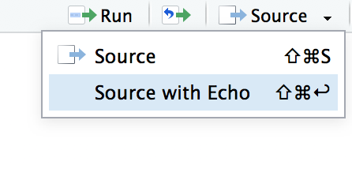

```{r,echo=FALSE}
rm(list=objects()) # start with a clean workspace
source("knitr_tweaks.R")
```

<!--
> The objective of cleaning is not just to clean, but to feel happiness living within that environment.<br>
> &nbsp;&nbsp;&nbsp;&nbsp;&nbsp;&nbsp;--[Marie Kondo](https://www.brainyquote.com/quotes/marie_kondo_723309)
-->

Programs come in a few different forms: the kind of program that we’re mostly interested in from the perspective of everyday data analysis using R is known as a **script**. The idea behind a script is that, instead of typing your commands into the R console one at a time, instead you write them all in a text file. Then, once you’ve finished writing them and saved the text file, you can get R to execute all the commands in your file by using the `source` function. In a moment I’ll show you exactly how this is done, but first I’d better explain why you should care.

## Why use scripts?

To understand why scripts are so very useful, it may be helpful to consider the drawbacks to typing commands directly at the command prompt. The approach that we’ve been adopting so far, in which you type commands one at a time, and R sits there patiently in between commands, is referred to as the **interactive style**. Doing your data analysis this way is rather like having a conversation ... a very annoying conversation between you and your data set, in which you and the data aren’t directly speaking to each other, and so you have to rely on R to pass messages back and forth. 

This approach makes a lot of sense when you’re just trying out a few ideas: maybe you’re trying to figure out what analyses are sensible for your data, or maybe just you’re trying to remember how the various R functions work, so you’re just typing in a few commands until you get the one you want. In other words, the interactive style is very useful as a tool for exploring your data. 

However, it has a number of drawbacks:

- *It’s hard to save your work effectively.* You can save the workspace, so that later on you can load any variables you created. You can save your plots as images. And you can even save the history or copy the contents of the R console to a file. Taken together, all these things let you create a reasonably decent record of what you did. But it does leave a lot to be desired. It seems like you ought to be able to save a single file that R could use (in conjunction with your raw data files) and reproduce everything (or at least, everything interesting) that you did during your data analysis.

- *It’s annoying to have to go back to the beginning when you make a mistake.* Suppose you’ve just spent the last two hours typing in commands. Over the course of this time you’ve created lots of new variables and run lots of analyses. Then suddenly you realise that there was a nasty typo in the first command you typed, so all of your later numbers are wrong. Now you have to fix that first command, and then spend another hour or so combing through the R history to try and recreate what you did.

- *You can’t leave notes for yourself.* Sure, you can scribble down some notes on a piece of paper, or even save a Word document that summarises what you did. But what you really want to be able to do is write down an English translation of your R commands, preferably right “next to” the commands themselves. That way, you can look back at what you’ve done and actually remember what you were doing. In the simple exercises we’ve engaged in so far, it hasn’t been all that hard to remember what you were doing or why you were doing it, but only because everything we’ve done could be done using only a few commands, and you’ve never been asked to reproduce your analysis six months after you originally did it! When your data analysis starts involving hundreds of variables, and requires quite complicated commands to work, then you really, really need to leave yourself some notes to explain your analysis to, well, yourself.

- *It’s nearly impossible to reuse your analyses later, or adapt them to similar problems.* Suppose that, sometime in January, you are handed a difficult data analysis problem. After working on it for ages, you figure out some really clever tricks that can be used to solve it. Then, in September, you get handed a really similar problem. You can sort of remember what you did, but not very well. You’d like to have a clean record of what you did last time, how you did it, and why you did it the way you did. Something like that would really help you solve this new problem.

- *It’s hard to do anything except the basics.* There’s a nasty side effect of these problems. Typos are inevitable. Even the best data analyst in the world makes a lot of mistakes. So the chance that you’ll be able to string together dozens of correct R commands in a row are very small. So unless you have some way around this problem, you’ll never really be able to do anything other than simple analyses.

- *It’s difficult to share your work other people.* Because you don’t have this nice clean record of what R commands were involved in your analysis, it’s not easy to share your work with other people. Sure, you can send them all the data files you’ve saved, and your history and console logs, and even the little notes you wrote to yourself, but odds are pretty good that no-one else will really understand what’s going on 

Scripts help you get around all these difficulties, and they're a good place to start if you want to learn more about how to author documents (like this webpage!) using more powerful tools like [R Markdown](https://bookdown.org/yihui/rmarkdown/).

## Example workflow

Suppose you start out with a data set `myrawdata.csv` (we'll talk about how to work with CSV file later). What you want is a single document – let’s call it `mydataanalysis.R` – that stores all of the commands that you’ve used in order to do your data analysis. Kind of similar to the R history but much more focused. It would only include the commands that you want to keep for later. Then, later on, instead of typing in all those commands again, you’d just tell R to run all of the commands that are stored in `mydataanalysis.R`. Also, in order to help you make sense of all those commands, what you’d want is the ability to add some notes or comments within the file, so that anyone reading the document for themselves would be able to understand what each of the commands actually does. But these comments wouldn’t get in the way: when you try to get R to run `mydataanalysis.R` it would be smart enough would recognise that these comments are for the benefit of humans, and so it would ignore them. Later on you could tweak a few of the commands inside the file (maybe in a new file called `mynewdatanalaysis.R`) so that you can adapt an old analysis to be able to handle a new problem. And you could email your friends and colleagues a copy of this file so that they can reproduce your analysis themselves.

## Adding comments

One of the most useful things you can do when writing scripts is to include human readable explanations of what your code does. Trust me, if you write good comments you'll thank yourself later. To do that, I need to introduce the comment character `#`. It has a simple meaning: it tells R to ignore everything else you’ve written on this line. For instance, if you read this

```{r}
seeker <- 3.1415          # create the first variable
lover <- 2.7183           # create the second variable
keeper <- seeker * lover  # now multiply them to create a third one
print(keeper)             # print out the value of ’keeper’
```

it’s a lot easier to understand what I’m doing than if I had omitted the comments. So, from now on, you’ll start seeing some `#` characters appearing in the code snippets, with some human-readable explanatory remarks next to them. 

## Our first script

Okay then. Since scripts are so terribly awesome, let’s write one. A script is just an ordinary text file, so you can write one in any text editor at all, but RStudio has a nice built in one so we'll use that. Go to the "File" menu, select "New File" and then choose "R Script". A new file will open in the top left panel of RStudio, into which we can type some commands. Let's type the following:
```{r,eval=FALSE}
x <- "hello world"
print(x)
```
Then save the script using the menus (File > Save) as `hello.R`. So far, nothing will happen. You should be looking at something like this:


If so, you have now successfully written your first R program. Because I don’t want to take screenshots for every single script, I’m going to present the content of scripts using the same kind of extracts that I've been using for everything else. So how do we run the script? I saved `hello.R` to a `scripts` folder, so I would run the script using the following command:
```{r}
source("./scripts/hello.R")
```
If you don't know how to interpret the `"./scripts/hello.R"`, don't panic. I'll talk about [file paths](./file-paths.html) later. But for now, just note that `.` means *the current folder*. Because these notes are posted on the web, `.` refers to the folder in which they are stored, which is `https://compcogscisydney.org/psyr`. So in these notes when I write that I have sourced the file locate at `"./scripts/hello.R"`, I'm referring to a real file located here:

https://compcogscisydney.org/psyr/scripts/hello.R

Indeed if you click on that link you'll see that this is where the script lives!

Most of the time you don't bother typing the `source` command manually. Instead you can achieve the same outcome by clicking on the "source" button in RStudio, shown in the top right of the screenshot above. If we now inspect the workspace using a command like `who` or `objects`, we discover that R has created the new variable `x` within the workspace, and not surprisingly `x` is a character string containing the text `"hello world"`. And just like that, you’ve written your first program R. It really is that simple.

## Minor differences

For the most part, commands that you insert into a script behave in exactly the same way as they would if you typed the same thing in at the command line. The one major exception to this is that if you want a variable to be printed on screen, you need to explicitly tell R to print it. You can’t just type the name of the variable. For example, our `hello.R` script produced visible output. The following script does not:

```{r,echo=FALSE}
x <- "hello world"
x
```

It does still create the variable `x` when you `source` the script, but it won’t print anything on screen. If you want to make R produce exactly the same output in the console that would occur if you were typing interactively, you can select the "source with echo" option like this:




## Exercises

- Write a script that calculates the number of seconds in a year (assuming 365 days), and prints the result to the console
- After saving your script as `myscript.R` or whatever, close RStudio. It will probably ask if you want to "save the workspace" as ".Rdata" or something similar. Ignore that message and select "no" (we'll talk about workspaces shortly). Reopen RStudio and run your script.

A script that solves the first problem is included [here](./scripts/solutions_scripts.R).


