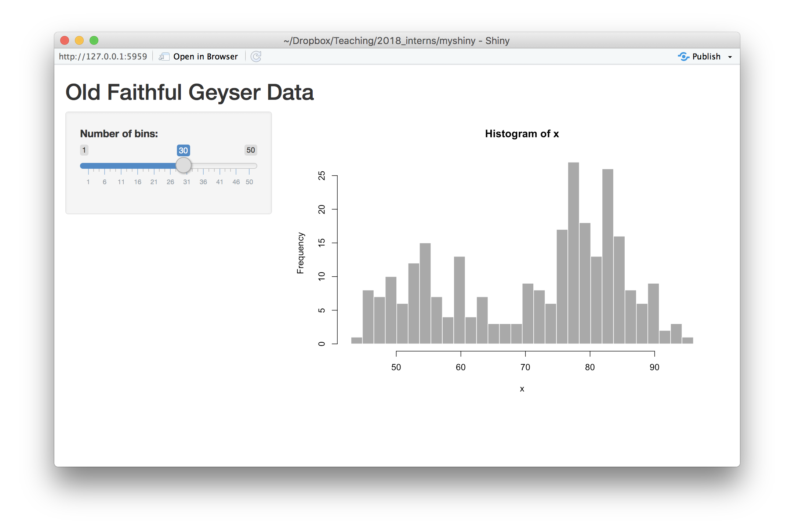
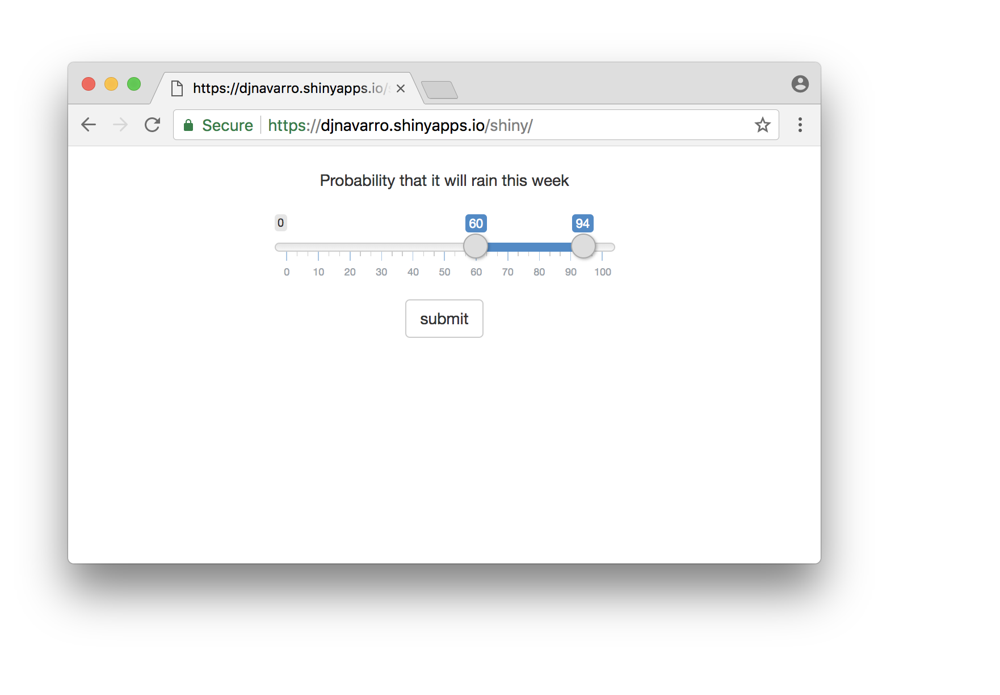

```{r,include=FALSE}
rm(list=objects()) # start with a clean workspace
source("knitr_tweaks.R")
library(tidyverse,quietly = TRUE)
library(shiny, quietly = TRUE)
library(shinyjs, quietly = TRUE)
library(rdrop2, quietly = TRUE)
```

> Shiny. <br>
> &nbsp;&nbsp;&nbsp;&nbsp;&nbsp;&nbsp;--*Firefly*, 2002


In this chapter we'll introduce the idea of a Shiny web application. Shiny apps were primarily designed to be tools for interactive data visualisation, but they're extremely flexible things and we can use them as tools for psychological experiments. The chapter draws heavily on a variety of other resources. Some good places to look:

- Official [shiny tutorials](http://shiny.rstudio.com/tutorial/) 
- Cloud hosting with [shinyapps.io](https://www.shinyapps.io)
- The [ShinyPsych](https://ndphillips.github.io/ShinyPsych.html) package (early in development)

In addition to the `shiny` package itself, the applications we'll talk about rely to some degree on the `shinyjs` package and the `rdrop2` package:

- The [shinyjs](https://deanattali.com/shinyjs/) package
- The [rdrop2](https://github.com/karthik/rdrop2) package

Make sure all three packages are installed, using the `install.packages` function.

## Creating a web application 

To get started, let's just create a web application as quickly as possible, and not worry too much about understanding what's going on. Follow these steps:

- Go to the RStudio "file" menu and select "new project..."
- When the dialog box comes up, select the option creating a project in a "new directory" 
- Select "shiny web application"
- When it asks you to choose a folder, type in something sensible like "myshiny"
- This opens up a new file `app.R` with a bunch of incomprehensible R code 
- Ignore the code, and click on the "run app" button to see what happens...

A window should open up, and you should be looking at something like this:



This application is an interactive histogram where the user can play around with the slider bar on the left, and the application will redraw the histogram on the right, in order to show the effect of changing the number of bins in a histgram. To get a feel for how the applicaton works: 

- Try playing around with the slider.
- Click the "open in browser" button to see what it looks like in the browser

At this point, we have created a web application, albeit one that runs locally on your own computer. And of course we have no idea how it works. But we'll get to that...

## Hosting the application

Continuing the trend of "doing things without really knowing what's going on", let's create an account with [shinyapps.io](https://www.shinyapps.io) to host the application for us. If you click on the "publish" button, you'll be prompted to create a shinyapps.io account:


Click the "get started here" link and it will take you to their website where you'll be prompted to sign up for an account and select a username (I'm `djnavarro`). Once you do that, you'll need to connect your shinyapps.io account with your computer. The process for that is:

1. Click on your username (top right in the shinyapps.io account page), then select "tokens"
2. Click on "show" to bring up the token information
3. Click on "copy to clipboard", and copy the token information to the clipboard!
4. Then, back in RStudio, paste the results into the dialog box.

Visually, this is what you should be expecting to see at each step...


Now you're done. Your computer is linked to your shinyapps.io account. Now, when you click on "publish" for the app, it will bring up a new dialog box. Click "publish", wait around for a bit while RStudio uploads everything to the web, and then check out your shiny new Shiny app...


If you look at your dashboard on the shinyapps.io website, you'll now see that you have a web application running:


Under the applications menu you'll see a variety of options, including the ability to delete the application if you don't want it any more.

## Structure of a Shiny app

When you look at the R code for the default shiny app in `app.R` you'll see it has this structure:

```{r,eval=FALSE}
library(shiny)

ui <- fluidPage(
  # ... BLAH BLAH BLAH ...
)

server <- function(input, output) {
  #... BLAH BLAH BLAH ...
}

shinyApp(ui = ui, server = server)
```

This structure reflects the fact that Shiny is designed to produce *web* applications. Like any web application it is based around the idea that we can divide responsibility between two machines, the *server* that hosts the application, and the *client* that interacts with it. For a Shiny app, the server is a machine running R, and uses R (plus some other things) to generate the content. The client does not need to have R installed: as long as it has a modern web browser it will be able to render the page just fine.^[Shiny relies on [bootstrap](https://getbootstrap.com/) to do all the fancy web stuff. You don't need to know anything about bootstrap to make Shiny apps though.] In essense, the server generates content, the client displays it. So the Shiny application needs to specify some rules for the user interface `ui`, and for the behaviour of the `server`. This architecture is illustrated below:


When you run a Shiny app *locally*, your own machine (e.g., you laptop) plays both roles: your copy of R acts as the server, and your web browser acts as the client. When you push the app to the cloud, a machine somewhere else (e.g., run by shinyapps.io) is the server, and anyone visiting the website can be the client. The R code is pretty much identical in both cases, and as you can see in the figure below, the structure of the application maps on to the structure of the code in `app.R`:


## Building our very own Shiny app

To understand how to build a Shiny app, let's build one to run a very simple psychology experiment. Suppose I'm interested in how people express their uncertainty about a probabilistic event. For instance, it might rain next week. According to meteorologists, there is some probability $p$ that it will rain - they have some uncertainty about whether the event (rain) will actually occur, and it is this uncertainty that the forecast probability $p$ captures. However, I have some additional uncertainty over and above that - I don't really know what the probability of rain actually is. So from my point of view this could be thought of as an *imprecise probability*... I might not be willing to make any *specific* claim about the probability of rain, but I might be able to provide a *range* of probabilities that seem acceptable. So I might say that the chance of rain is somewhere between 60% and 90%. Okay, so maybe I would like to run a simple web survey asking people to provide interval estimates, and after a bit of thinking I might decide I'd like the survey to look like this:



On every trial the participant is presented with some text describing the unknown probability, and their task is to adjust the slider to produce an interval that they are happy with. Once they've got the sliders located somewhere they like, they can click the "submit" button and move onto the next trial. How can we build this using Shiny?


### Create the project

When starting out, we'll create a project skeleton consisting of three separate R scripts in an attempt to try to keep ourselves organised. These are:

- `app.R` loads any R packages, sources the other R scripts when needed, and creates the Shiny app from the content that those scripts provides
- `makeServer.R` creates the `server` for the Shiny app
- `makeUI.R` creates the user interface `ui` for the Shiny app.

To do this, the `app.R` file contains the following code:

```{r,eval=FALSE}
# load packages
library(shiny)   # the shiny package

# structure of the application
source("makeUI.R")     # construct the user interface
source("makeServer.R") # construct the server function

# create the shiny app
shinyApp(ui, server)
```

The `makeServer.R` function initially contains a "placeholder" function. It won't actually do anything yet, it's just there to make sure that there actually is a `server` object!

```{r,eval=FALSE}
server <- function(input, output) {
  # initially, our server ignores the user
  # this is just a place holder
}
```

With that in place, we can get started on the `makeUI.R` function to build the user interface object `ui`...

### Designing a user interface

The vertical layout for our study is pretty typical for psychology experiments. At the top is a *content* area that displays the stimulus material (i.e., the question), in the middle there is a *response* area that allows the user to interact with the stimulus (i.e., the slider) and at the bottom there is an *action* button that allows the user to submit the response and move on to the next trial. There are a few different ways we could create this layout, but let's do a simple thing and stack everything on top of each other. Conceptually, what we're going to create is this:


So the first thing we're going to do when creating the `makeUI.R` function is set it up with the structure shown above:

```{r,eval=FALSE}
ui <- fluidPage( 
  fluidRow( # the page has one row...
    column( # ... and the row has one column
      
      # information about the column
      # content area
      # response area
      # action button
      
    )
  )
)
```

This `ui` object is created by three nested function calls: there is a call to the `column` function, and the output is then fed into `fluidRow`, the row is fed into `fluidPage`, and then the page is saved as the `ui` object. Let's not worry too much about precisely *what* information is being passed between these functions, and instead think about our content...

Before doing anything else, we need to say something about the column. Conceptually, the way Shiny apps work is by dividing the horizontal space into 12 numbered "slots", so we need to tell the `column` function which slots out column will occupy, and how many slots it occupies. The way I'll do that is by specifying the mandatory `width` argument and the optional `align` argument that tells R how to justify content:

```{r}
ui <- fluidPage( 
  fluidRow( # the page has one row...
    column( # ... and the row has one column
      
      # information about the column
      width = 8,        # specify the column width (between 1 and 12)
      align = "center"  # how to align content inside the column
      
      # content area
      # response area
      # action button
      
    )
  )
)
```

Okay, now we have the basic structure of the UI, all we have to do is put something in it! However, the specifics of what should go in these different areas could be very different from one study to the next, so it might make a lot of sense to create a separate `study.R` script define study-specific content. To accomodate this, we'll edit the `makeUI.R` script so that it now looks like this:

```{r,eval=FALSE}
ui <- fluidPage( 
  fluidRow( # the page has one row...
    column( # ... and the row has one column
      
      # information about the column
      width = 8,        # specify the column width (between 1 and 12)
      align = "center",   # how to align content inside the column
      
      # study-specific objects (see the "study.R" file)
      myContent,  # content area
      myResponse, # response area
      myAction    # action button

    )
  )
)
```

As long as the `study.R` script defines `myContent`, `myResponse` and `myAction` properly, this code will work fine and create a `ui` object that is suitable for our Shiny app. The overall structure of our project has altered slightly...

- `app.R` loads R packages, sources R scripts, and creates the Shiny app 
- `study.R` creates study-specific objects
- `makeServer.R` creates the `server` for the Shiny app
- `makeUI.R` creates the user interface `ui` for the Shiny app.

... and as a consequence we'll have to make some minor changes to the `app.R` file, which now looks lilke this:

```{r,eval=FALSE}
# load packages
library(shiny)   # the shiny package

# structure of the application
source("study.R")      # create study-specific objects
source("makeUI.R")     # construct the user interface
source("makeServer.R") # construct the server function

# create the shiny app
shinyApp(ui, server)
```


### Adding user interface objects

We need to create three user interface objects: `myContent` displays the question, `myResponse` specifies the slider, and `myAction` specifies the "submit" button. The `Shiny` package supplies a variety of functions that are suitable for this purpose:

- `textOutput` creates a "text output element" capable of receiving text from the server and displaying it to the user. We won't do anything with this right now: it will be the server's job to work out what information to send to ths object.
- `sliderInput` creates a customisable "slider widget" that the server can inspect. We'll set it up so that the server inspects the values of the slider (obviously, we'll need two values!) at the end pof each trial.
- `actionButton` creates an "action button", which looks a lot like an ordinary button but has some very nice properties if you want to use it as a "next trial" button. Initially it starts with a "value" (invisible, obviously) of 0, but every time it is clicked this value increases by 1. Very handy for specifying the trial number! 

The first version of our `study.R` file looks like this:

```{r}
# ---- user interface objects for the study ----

myContent <- textOutput( 
  outputId = "content"
  )

myResponse <- sliderInput(
  inputId = "response", 
  label = "", 
  min = 0, 
  max = 100, 
  value = c(40, 60)
  )

myAction <- actionButton(
  inputId = "action", 
  label = "submit"
  )
```

Hopefully it's pretty clear what each of the arguments here is doing. For instance, the slider bar ranges from a minimum value of 0 to a maximum of 100, and it is initially set to have values of 40 and 60. The important thing to note is that the `myResponse` and `myAction` objects both have an `inputId` (the user can supply input with these), and the `myContent` object has an `outputId` 
(the server can send output to this), emphasising the different roles they play in the application.

At this point, we actually have a properly specified Shiny app. To see this, go to the `app.R` file and click "run app". You'll see something like this pop up:


It won't actually do anything though. You can play with the slider and click on the button, but nothing will happen in response because the `server` isn't listening to the user input, and there's no text being displayed because it isn't generating any output. So the next thing we'll need to work on the `makeServer.R` file

### Specifying the server

Currently, the server side of the Shiny application is pretty much empty. All we have is this:
```{r}
server <- function(input, output) {
  # initially, our server ignores the user
  # this is just a place holder
}
```
There's something worth pointing out even with this blank server though. The Shiny framework expects `server` to be a function with (at least) two arguments. The `input` argument tells the server what do do with user input, and the `output` argument tells it how to generate output for the user. Conceptually, there are three different jobs the server needs:

- It needs a representation of the `study` materials (the questions). That's a study specific thing, so what we'll do is assume that `study` is a list object, with one element per trial, such that `study[[1]]` contains the relevant information for trial 1. We'll assume that the `study` list is produced by a `myStimuli` function that we'll have to add to the `study.R` file.
- It needs to know what to *do* with the stimulus material. Specifically, it needs to produce some `output` that will go back to the user interface. The way we designed our UI was that there is object that has an output ID of ``"content"``, so any server output that has to go to that object needs to be assigned to `output$content`. All the details for this will be handled by two functions `processContent` and `renderContent` that we'll specify in the `study.R` file. 
- Finally, it needs to know how to end the trial when the user clicks the action button. For that, we'll need to specify and `endTrial` function.


To reflect these needs, we'll modify the `makeServer.R` file as shown below:


```{r, eval=FALSE}
server <- function(input, output) {
  
  # read the stimulus materials
  study <- myStimuli()
  
  # how to generate a trial? (specifically, the *next* trial)
  output$content <- renderContent(
    expr = processContent( study[[input$action+1]] )
  )
  
  # how to handle the end of the current trial?
  observeEvent(
    eventExpr = input$action, # when user clicks the action button
    handlerExpr = endTrial(input, study) # end this trial
  )
}

endTrial <- function(input, study) {
  # placeholder: right now the server doesn't do anything
  # special to correspond to the "end of trial" event
}
```

Notice that we've added the `endTrial` function already. We'll also need to create some placeholder functions in the `study.R` file, so we'll add the following to the bottom of that file:

```{r}
# ---- server content for the study ----

myStimuli <- function() {
  # placeholder
}

processContent <- function() {
  # placeholder
}

renderContent <- renderText # the output is text format
```

At the moment the `myStimuli` and `processContent` functions don't do anything, but we've already specified the   `renderContent` function. It's deeply uninteresting: the Shiny package contains different "rendering" functions that tell the server how to handle different kinds of output. So there's a `renderText` function that you should use if the server is talking to a `textOutput` user interface object, a `renderPlot` function that you should use if it's a `plotOutput`, etc. Since for this study our `content` area just displays a piece of text, the rendering function we want is `renderText`

### Specifying & processing stimuli 

What about `myStimuli` and `processContent` functions? Our study is actually pretty simple, and each trial can be specified with a single piece of text (the question!), and there's no processing required to do anything interesting with that text. So we can just specify a list of questions in the `myStimuli` function, and have a "dummy" function for `processContent` that just passes the input straight through without doing anything to it. 

So now our `study.R` script now looks like this:

```{r}
# ---- user interface objects for the study ----

myContent <- textOutput( 
  outputId = "content"
  )

myResponse <- sliderInput(
  inputId = "response", 
  label = "", 
  min = 0, 
  max = 100, 
  value = c(40, 60)
  )

myAction <- actionButton(
  inputId = "action", 
  label = "submit"
  )

# ---- server content for the study ----

myStimuli <- function() {
  stimuli <- list(
    "Probability that it will rain this week",
    "Probability that humans will be extinct within 1000 years",
    "Probability that you will do honours psychology",
    "Probability that the world ends not with a bang, but with a whimper"
  )
  return(stimuli)
}

processContent <- function(stimulus) {
  return(stimulus)
}

renderContent <- renderText # the output is text format
```

We now have a version of the app that presents the questions to the user one at a time. Every time the user clicks the "submit" button the server notices and changes the display to the next item in the list. Click on the "run app" button and play around with it to see. What you should notice is that we have a few problems still:

- the stimuli are always presented in the same order
- the application it doesn't reset the slider values at the start of each trial
- the application generates an error when it runs out of stimuli
- the application isn't recording participant responses

The first of these is easy to fix. We'll modify the `myStimuli` function so that it shuffles the stimulus list into a random order using the `sample` function. That only requires us to add one line to the function, as shown here:

```{r}
myStimuli <- function() {
  stimuli <- list(
    "Probability that it will rain this week",
    "Probability that humans will be extinct within 1000 years",
    "Probability that you will do honours psychology",
    "Probability that the world ends not with a bang, but with a whimper"
  )
  stimuli <- sample(stimuli) # randomise order
  return(stimuli)
}
```

The others require a little more thought. Let's start by dealing with the "slider reset" problem. 


### Tweaking the UI with `shinyjs`

There are lots of ways that we can deal with the issue of reseting the slider to its initial value at the start of every trial, but the one we'll rely on uses the `shinyjs` (short for Shiny javascript) package to have the user interface solve this problem itself using the client machine's web browser to do the work. Since every modern web browser comes with a full fledged implementation of javascript, it's more than qualified to do the job. First, we'll need to modify the `app.R` script to ensure that the package is loaded:

```{r,eval=FALSE}
# load packages
library(shiny)   # the shiny package
library(shinyjs) # shinyjs is handy

# structure of the application
source("study.R")      # create study-specific objects
source("makeUI.R")     # construct the user interface
source("makeServer.R") # construct the server function

# create the shiny app
shinyApp(ui, server)
```

Next, we'll need to tell the `ui` that it should be relying on `shinyjs`, which we can do by sneaking the command into the `makeUI.R` file like this:

```{r, eval = FALSE}
ui <- fluidPage( 
  fluidRow( # the page has one row...
    column( # ... and the row has one column
      
      # information about the column
      width = 8,         # specify the column width (between 1 and 12)
      align = "center",  # how to align content inside the column
      
      # study-specific objects (see the "study.R" file)
      myContent,  # content area
      myResponse, # response area
      myAction,   # action button
      
      # force the ui to use shinyjs
      shinyjs::useShinyjs()
      
    )
  )
)
```

Finally, because the reset is something that should occur at the end of each trial, we'll add this as an instruction to the `endTrial` function within the `makeServer.R` script:

```{r}
endTrial <- function(input, study) {

  # before each trial, use shinyjs reset the response object
  reset("response") 
  
}
```

As usual, test it out using the "run app" button! The current version now presents stimuli in a random order and resets the slider after every response.

### Ending the experiment

Next on our "to do" list is finding a way to end the experiment that is a little more graceful than showing an angry red error message on the user screen. Once again, we'll rely on `shinyjs` to do the work here. First, we'll make another small modification to the `ui` by inserting a "hidden" thank you message. At the start of the experiment this is invisible, so from the user perspective nothing changes:

```{r}
ui <- fluidPage( 
  fluidRow( # the page has one row...
    column( # ... and the row has one column
      
      # information about the column
      width = 8,         # specify the column width (between 1 and 12)
      align = "center",  # how to align content inside the column
      
      # study-specific objects (see the "study.R" file)
      myContent,  # content area
      myResponse, # response area
      myAction,   # action button
      
      # hidden thank you message
      hidden(p(id="thankYou", "All done! Thanks")),
      
      # force the ui to use shinyjs
      shinyjs::useShinyjs()
      
    )
  )
)
```

Then, all we need to do on the `server` side is add some code that will notice when the study is over. To do that, recall from earlier how the action button has a "value" that starts at zero and increments by 1 every time the user presses it? It's this value that the server has been using to work out which trial it's up to, so it's pretty straightforward to use this information as part of the `endTrial` function:

```{r}
endTrial <- function(input, study) {

  # before each trial, use shinyjs reset the response object
  reset("response") 
  
  # trial number
  trialNum <- input$action
  
  # end the experiment if needed
  if(trialNum == length(study)) {
    
    # tidy up
    hide("response")
    hide("action")
    hide("content")
    show("thankYou")
    
  }
}
```

So what we have now is a server where at the end of every trial it check the `trialNum` and if that's equal to the length of the `study` itself, it means we've reached the end of the experiment. When that happens, it triggers a tidy up action: the three UI objects are all hidden using the `hide` function in `shinyjs` and the thank you message is revealed using `show`. 

Again, check it out: the application should now end after four responses.


### Recording the trial data

From the participant experience perspective, the experiment now runs perfectly (or as perfectly as I intend to make it). The stimuli are randomised, the trials reset properly, and the experiment ends when it's supposed to. The only problem is that it's not **recording** anything. Without any data our experiment is pretty useless! 

The first thing we need to do is work out what data we're actually going to store. Since that's pretty study specific, let's define a `getTrialData` function in the `study.R` file that returns a data frame that consists of a single row, with one column per variable:

```{r}
# ---- what data to record? ----
getTrialData <- function(input, stimulus) {

  trialData <- data.frame(
    trial = input$action,      # the trial number
    question = stimulus,       # what question was posed? 
    lower = input$response[1], # response (lower value)
    upper = input$response[2]  # response (upper value)
  )
  return( trialData )
}
```

In the `makeServer.R` function we need to do two things. We need to create a data frame called `responses` that will store all the trial data, and we need to add some code that calls the `getTrialData` function to obtain data at the e3nd of every trial the trial and then writes it to the `responses` data frame. That measn we need to modify the `endTrial` function, and add one extra line at the bottom:^[This uses the `<<-` operator to ensure that the `responses` variable is visible to every other function on the server (i.e., global). That's not ideal programming, but I haven't worked out a better solution yet!]

```{r}
endTrial <- function(input, study) {

  # before each trial, use shinyjs reset the response object
  reset("response") 
  
  # trial number
  trialNum <- input$action
  
  # get the data for this trial
  trialData <- getTrialData(input, study[[trialNum]]) 
  
  # update data storage
  if(trialNum == 1) {
    responses <<- trialData  # yes, the <<- is intentional
  } else {
    responses <<- rbind(responses, trialData)
  }
  
  # end the experiment if needed
  if(trialNum == length(study)) {
    
    # tidy up
    hide("response")
    hide("action")
    hide("content")
    show("thankYou")
    
  }
}

responses <- data.frame() # initialise the data set
```

At this point we're almost completely done. The experiment runs, it records the data, the only thing it doesn't do is *save* the data anywhere. So that's our final job, and in order to avoid messiness, we'll set the application up in such a way that the data get written to your Dropbox account. To do that, we'll add a few minor change to the application...

### The (almost) complete app

Before taking care of our final task, let's have a look at what our almost-complete application looks like. The final version will have five files, with this structure:

- `app.R` loads R packages, sources R scripts, and creates the Shiny app 
- `study.R` creates study-specific objects
- `makeServer.R` creates the `server` for the Shiny app
- `makeUI.R` creates the user interface `ui` for the Shiny app.
- `saveData.R` handles saving the data

With the exception of `saveData.R` the application is finished. Here's what the final version of `app.R` looks like:

```{r,eval=FALSE}
# load packages
library(shiny)   # the shiny package
library(shinyjs) # shinyjs is handy
library(rdrop2)  # needed to save data to dropbox

# structure of the application
source("study.R")      # information specific to the study 
source("saveData.R")   # how should we save the responses?
source("makeUI.R")     # construct the user interface
source("makeServer.R") # construct the server function

# create the shiny app
shinyApp(ui, server)
```

Notice that I've added two lines since last time, one to load the `rdrop2` package that we'll use to save data, and another to source the `saveData.R` script that will handle the saving of data.

The final version of the `study.R` function looks like this:

```{r}
# ---- user interface objects for the study ----

myContent <- textOutput( 
  outputId = "content"
  )

myResponse <- sliderInput(
  inputId = "response", 
  label = "", 
  min = 0, 
  max = 100, 
  value = c(40, 60)
  )

myAction <- actionButton(
  inputId = "action", 
  label = "submit"
  )

# ---- server content for the study ----

myStimuli <- function() {
  stimuli <- list(
    "Probability that it will rain this week",
    "Probability that humans will be extinct within 1000 years",
    "Probability that you will do honours psychology",
    "Probability that the world ends not with a bang, but with a whimper"
  )
  stimuli <- sample(stimuli) # randomise order
  return(stimuli)
}

processContent <- function(stimulus) {
  return(stimulus)
}

renderContent <- renderText # the output is text format

# ---- what data to record? ----

getTrialData <- function(input, stimulus) {

  trialData <- data.frame(
    trial = input$action,      # the trial number
    question = stimulus,       # what question was posed? 
    lower = input$response[1], # response (lower value)
    upper = input$response[2]  # response (upper value)
  )
  return( trialData )
}

# ---- information needed for saving data ----
 
saveMethod <- "dropbox"
saveDir <- "Teaching/2018_interns/shiny_data"
```

Notice the last two lines are new. The `saveMethod` variable indicates that we'll upload any generated data file to Dropbox, and the `saveDir` variable specifies the subfolder in my Dropbox account to which files will be uploaded.

Here's the final version of `makeUI.R` which hasn't changed since last time:

```{r}
ui <- fluidPage( 
  fluidRow( # the page has one row...
    column( # ... and the row has one column
      
      # information about the column
      width = 8,         # specify the column width (between 1 and 12)
      align = "center",  # how to align content inside the column
      
      # study-specific objects (see the "study.R" file)
      myContent,  # content area
      myResponse, # response area
      myAction,   # action button
      
      # hidden thank you message
      hidden(p(id="thankYou", "All done! Thanks")),
      
      # force the ui to use shinyjs
      shinyjs::useShinyjs()
      
    )
  )
)
```

Here's the final version of `makeServer.R`:

```{r}
server <- function(input, output) {
  
  # read the stimulus materials
  study <- myStimuli()
  
  # how to handle the end of the current trial?
  observeEvent(
    eventExpr = input$action, # when user clicks the action button
    handlerExpr = endTrial(input, study) # end this trial
  )
  
  # how to generate the next trial?
  output$content <- renderContent(
    expr = processContent( study[[input$action+1]] )
  )
  
}

endTrial <- function(input, study) {

  # before each trial, use shinyjs reset the response object
  reset("response") 
  
  # trial number
  trialNum <- input$action
  
  # get the data for this trial
  trialData <- getTrialData(input, study[[trialNum]]) 
  
  # update data storage
  if(trialNum == 1) {
    responses <<- trialData
  } else {
    responses <<- rbind(responses, trialData)
  }
  
  # end the experiment if needed
  if(trialNum == length(study)) {
    
    # tidy up
    hide("response")
    hide("action")
    hide("content")
    show("thankYou")
    
    # save data 
    saveData(method = saveMethod)
    
  }
}

responses <- data.frame() # initialise the data set
```

Again, there's one small tweak: at the end of the experiment the server calls the `saveData` function. So that just leaves the `saveData.R` script, which we haven't written yet. To get started, we'll create a dummy file:

```{r}
saveData <- function(method="none") {
  # content goes here
}
```


### The `rdrop2` package

We'll want to save data on our Shiny app. The simplest way to do that is to link your Dropbox account (assuming you have one) to the Shiny app, which you can do easily with the help of the `rdrop2` package. After installing the package, you'll need to authorise the package to make changes to your Dropbox account. This is surprisingly easy:

```{r, eval=FALSE}
library(rdrop2)
drop_auth()
```

This will then take you to the Dropbox website where you can authorise the package. Having done so, all we'll need to do is modify our Shiny app so that it saves data to your Dropbox. I'll show that in the next section.

### Saving the data

Here's the final code for the `saveData.R` script. The key thing to note is that it has two different ways to save data, a `saveDropboxData` function that will upload the data to your Dropbox account, and a `saveLocalData` that will write the data to a location on the server (that would be your laptop if running locally, but could be somewhere else if you're doing a cloud based deployment). Regardless of which version you use, the file is a CSV file that saves the value of the `responses` data frame, and the file name is always of the form `data-YYYY-MM-DD-HH-MM-SS.csv`, where  `YYYY-MM-DD-HH-MM-SS` is a time stamp specifying the year, month, day, hour, minute and second that the server created the file. As long as you don't have two people completing the task at the same second (usually reasonable, but not always, so you might want to modify this if you're doing a large online study), the file will be unique. 

```{r}
saveData <- function(method="none") {
  if(method == "dropbox") saveDropboxData(saveDir) 
  if(method == "local") saveLocalData(saveDir) 
}

saveLocalData <- function(outputDir){
  fileName <- makeFileName()                 # file name
  filePath <- file.path(outputDir, fileName) # path to file
  writeData(filePath)                        # write file
}

saveDropboxData <- function(outputDir) {
  fileName <- makeFileName()                 # file name
  filePath <- file.path(tempdir(), fileName) # temporary directory
  writeData(filePath)                        # write to temp directory
  drop_upload(filePath, path = outputDir)    # upload to dropbox
}

makeFileName <- function() {
  timeStampString <- format(Sys.time(), "%Y-%m-%d-%H-%M-%S") # get system time
  fileName <- paste0("data-", timeStampString, ".csv")       # timestamped file name 
  return(fileName)
}

writeData <- function(filePath) {
  write.csv(
    x = responses,     # the data
    file=filePath,     # where to write it
    row.names = FALSE  # don't add row names to the csv
  )
}
```


### Done!

That's it. Not only have you built your first Shiny app, you have a reasonably flexible template that you can reuse for a lot of pretty standard psych experiments. All you need to do for a lot of typical studies is edit the `study.R` file: the rest of it should work fine. If you want to use this template, I've put it up on Github here: https://github.com/djnavarro/blankshiny


## Shiny psych experiments

At some point I'll try to put together a mini library of experiments that you can run with this template. But just to give you a sense of it, here's one where I modified the `study.R` file so that the task is now to estimate the correlation between some points:

```{r}
# ---- user interface objects for the study ----

myContent <- plotOutput(  # the content is a plot
  outputId = "content",
  width = "300px",        # plot width in pixels
  height = "300px"        # plot height in pixels
  )

myResponse <- sliderInput(
  inputId = "response", 
  label = "", 
  min = -1,    # minimum response
  max = 1,     # maximum response
  step = .01,  # slider increments in steps of .01
  value = 0    # slider starts at 0
  )

myAction <- actionButton(  # no changes needed
  inputId = "action", 
  label = "submit"
  )

# ---- server content for the study ----

myStimuli <- function() {
  
  # mvtnorm package lets you sample from a bivariate
  # normal distribution where correlation may be present
  # (make sure you have it installed!)
  library(mvtnorm)  
  
  ntrials <- 5  # number of trials
  npoints <- 50 # how many points in the plot

  stimuli <- list()
  for(i in 1:ntrials) {
    r <- runif(1)*2 - 1            # true correlation in the popuation
    xy <- rmvnorm(                 # sample from a multivariate normal...
      n=npoints,                   # ... how many points
      mean=c(0,0),                 # ... population mean
      sigma=matrix(c(1,r,r,1),2,2) # ... population covariance
    )
    stimuli[[i]] <- xy  # store the raw co-ordinates as the "stimulus"
  }
  
  return(stimuli)
}

processContent <- function(stimulus) {
  
  plot(                # to "process" the stimulus we draw a plot
    x = stimulus[,1],  # x-value
    y = stimulus[,2],  # y-value
    axes = FALSE,      # don't show axes
    pch=19,            # plot marker is a filled circle
    main="Please estimate the correlation",    # plot title
    xlab = "",         # no x-axis label
    ylab = ""          # no y-axis label
    )
}

renderContent <- renderPlot  # content rendering function is now renderPloy

# ---- what data to record? ----

getTrialData <- function(input, stimulus) {

  trialData <- data.frame(
    trial = input$action,           # the trial number
    question = cor(stimulus)[1,2],  # what was the *sample* correlation?
    response = input$response       # participant response
  )
  return( trialData )
}

# ---- information needed for saving data ----
 
saveDir <- "Teaching/2018_interns/shiny2_data"   # save it to this directory
saveMethod <- "dropbox"
```

It produces an experiment that looks like this:


So that's nice.


